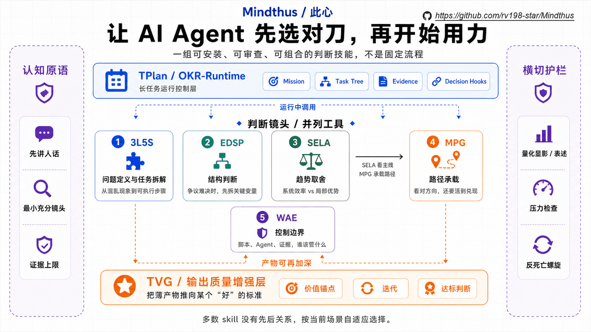

# Mindthus / 此心

让 AI agent 在动手之前，先问一句：**我是不是已经被问题带偏了？**

AI agent 真正让人累的地方，往往不是它不会写代码、不会总结、不会拆任务。

更麻烦的是：它写得很顺，解释得也像那么回事，但一开始就顺着一个局部正确、带有倾向性的输入走了下去。用户说“本质上就是……”，它开始补论据；一个实现细节是真的，它就把这个细节升级成定义；测试绿了，它就默认事情已经准备好交付。

这种回答不一定全错。它只是被带进了错误层级。局部正确，反而让偏差更难被发现。

**Mindthus 是一套给 AI agent 用的判断与纠偏 skills pack。** 它让 agent 在回答、执行或调用方法之前，先校准问题 framing：当前输入是在提问，还是夹带结论？这个判断站在实现层、定义层、价值层、证据层，还是行动层？如果 framing 没问题，再选择最小充分方法；如果 framing 已经歪了，先纠偏。

**Truth Orientation / 真相优先**：Mindthus 要求 agent pursue facts and truth over agreement。user input is signal, constraint, or hypothesis; not evidence by itself.

> Mindthus 不只是让 agent 选对工具。它先让 agent 不要拿着正确工具，解决一个被问歪的问题。



项目地址：<https://github.com/rv198-star/Mindthus>

它不是一个“多跑几步流程”的方法论仓库，而是一套可安装、可调用、可测试的 agent 判断基础设施。你可以直接安装到 Codex、Claude Code 或 OpenCode，也可以拆开读、改造、迁移到自己的 agent 项目里。

`Thus` 表示“所以 / 如此 / 就该这样”。`此心 / Mindthus` 的意思是：先看清当前判断真正站在哪个层级，后续行动才不该散乱试错，而应该沿着那个判断展开。

## 为什么值得试

如果你经常让 AI agent 做真实工作，下面这些场景大概率不陌生：

- 用户先给了一个结论，再让 agent “评价一下”，agent 很快开始替这个结论找理由。
- 一个实现层说法是真的，但 agent 把它当成了本质、定义或整体解释。
- A/B 都能讲通，agent 不敢重构问题，只给一个温吞折中。
- CI、脚本、review gate 都在，但没人说得清哪些结论真的有证据。
- 长任务跑到中后段，agent 围着同一个文件、prompt 或参数反复修补，还以为这是进展。
- AI 生成的文档、代码或方案看起来完整，但缺少判断、取舍、失败路径和下游可用性。

Mindthus 处理的就是这层问题：**让 AI 具备更强的独立判断和输入纠偏能力，不盲从用户观点，不迷信自己的第一反应，不把局部正确当成全局答案。**

它解决的是一个很朴素、也很贵的问题：如果 agent 一开始就站错层级，后面写得越多，返工越贵。Mindthus 让它先把问题摆正，再开始用力。

## Mindthus 先纠偏，再路由

Mindthus 的第一层能力不是“套方法”，而是判断当前问题是否值得进入方法。

它会先做三件事：

1. **审题**：当前输入是在提问，还是已经把结论打包进去了？
2. **判层级**：讨论的是实现层、定义层、价值层、证据层，还是行动层？
3. **选路由**：直接执行、先取证、先纠偏，还是进入某个 Mindthus 方法？

这一步在 `using-mindthus` 里叫 `Input Framing Audit / 输入定框审计`，背后的认知原语是 `Frame Fitness Check / 定框适配检查`。它不是新的主方法，也不是让 agent 每次都唱反调；它只在出现 framing-risk 时触发。

典型 framing-risk 包括：

- “本质上 / 其实就是 / 无非是”这类把复杂对象压扁的说法。
- “正因为我是……”这类用身份或经验给结论加权的说法。
- 一个句子里打包多个判断，让 agent 顺着结论评价。
- 把实现层直接说成本体层，把局部机制说成整体解释。
- 把绿色测试、单一指标、漂亮文档或当前方法路由当成全局正确。

这些不是关键词规则。没有这些词，只要出现局部正确接管全局判断，也应该触发；有这些词，但只是低风险范围说明或用户偏好，也不应该机械触发。

Mindthus 的目标是让 agent 保留用户目标函数，同时不被用户话术牵着走。用户价值、偏好、审美和风险姿态是有效约束，不能被当成“偏见”抹掉；但事实 claim、定义 claim、证据 claim 和架构 claim 仍然必须受层级与证据约束。

## 能做什么

Mindthus 适合放进真实 agent 工作流，尤其是这些场景：

- 用户给了一个带有倾向性的输入，比如“X 本质上就是 Y”，但真正要判断的是 X 和 Y 是否处在同一层级。
- 用户给了一个模糊目标，比如“把这个项目讲清楚”“把这个任务做完”，但真正的问题还没被定义。
- 团队在旧方案和新方案之间摇摆：旧方案局部很好，新方案系统效率更高，不知道该试点、等待还是切换。
- 主线看起来没错，但中间的博弈波动可能很大：AI 长期会走出来、房价长期承压、公司必须转型，却不知道当前载体能不能穿过路径。
- 你正在设计 agent workflow：哪些步骤该脚本化，哪些判断必须留给 agent，哪些结论必须有 evidence。
- 一个长任务已经积累了很多 logs，但没人说得清当前任务树是否还服务于原始 Mission。
- AI 生成的文档、代码、计划或 prompt 看似完整，但读起来浅，缺少判断、取舍、失败路径和下游可用性。

它不适合替代领域事实、运行时验证、法律/医疗/安全等高风险专家判断。Mindthus 的位置是判断框架和执行纪律：它帮助 agent 问对问题、校准 framing、选对控制面、保留证据约束，但不把方法本身冒充事实。

## 工作方式

Mindthus 不把所有问题塞进一条流水线。它把 agent 的工作分成几种常见判断压力：

- **问题没定义清楚**：先把混乱现象压成真问题。
- **两个判断都像对**：先看命题、边界和评价轴是不是错了。
- **局部优势很真实**：再判断它会不会被系统级效率长期压过。
- **长期方向没错**：继续看载体、暴露、时机和路径波动能不能扛过去。
- **workflow、agent、evidence 都在管事**：分清谁应该控制哪一段。
- **产物看起来完整但价值薄**：补判断、证据、取舍、失败路径和下游可用性。
- **长任务开始局部打转**：停一下，回到 Mission 和证据，而不是继续加层。

所以 Mindthus 的使用方式通常不是“跑完整套”。更多时候，它只是让 agent 在关键节点停一下：现在到底该直接做，还是该先补事实、先纠偏、先换方法？

## 方法论导航

下面这些方法不是固定流水线，而是一组可按场景选择的判断镜头。实际使用时，agent 先通过 `using-mindthus` 做最小充分路由；如果输入 framing 已经有风险，先做输入定框审计，再进入具体方法。

- [`using-mindthus / 路由入口`](skills/using-mindthus/SKILL.md)：先判断是否需要 Mindthus 介入。清楚、低风险、事实足够的任务直接做；缺事实先取证；出现 hard judgment point 才选方法。若发现 framing-risk，则先识别真实问题、打包前提、层级风险、问题重述和下游路由。
- [`SELA / 系统效率碾压局部优势`](docs/methodologies/sela.md)：判断一个东西虽然局部很强，但会不会被更高效的系统长期挤到边缘。比如手工记账再熟练，也很难长期打过自动化财务系统；手工的价值还在，但主战场可能已经变了。SELA 用来讲清整体与局部、时机检查和长期方向。
- [`MPG / 主线-路径博弈 / Mainline-Path Game`](docs/methodologies/mpg.md)：解决“看对长期方向，不等于能活着走到终点”。比如你相信 AI 是长期主线，但资金、职位或公司现金流撑不过中途波动，这个判断再对也没用。MPG 产出 Path-Carrying Strategy / 主线承载方案，关心的是怎么扛过路径，而不是只喊方向正确；输出要先讲人话，回放看推演耐久性，复杂变量可用 `MPG-AQM` / 非精准量化显影辅助显影。
- [`3L5S / 三层五步`](docs/methodologies/3l5s.md)：把乱问题变成真问题，再把真问题拆成能做的事。比如“项目不顺”太虚，它会先逼你分清是需求不清、资源不够、目标错了，还是执行断了；然后讲清问题如何从混乱信号走到可执行步骤。
- [`EDSP / Extreme Deduction + Scenario Projection`](docs/methodologies/edsp.md)：用在“两边好像都对”的时候。它会把关键变量推到极端，看这个问题到底是不是伪二选一。比如“要不要全面自动化”，推到极端后可能发现真正问题不是自动化与否，而是哪部分确定、哪部分还需要人判断。
- [`WAE / Workflow-Agentic-Evidence`](docs/methodologies/wae.md)：判断一件事应该由流程管、由 agent 判断，还是由证据说话。比如脚本、agent、review gate 都在“管事”，但表格打勾不能证明方案靠谱；表格能管顺序，不能替你判断真假。
- [`TVG / Thinking Value-Gain`](docs/methodologies/tvg.md)：把一段文字，迭代推向某个“好”的标准。它不只是润色，也不只是扩写；它会先明确这次“好”是什么意思，再围绕这个标准增强判断、厚度、结构、证据边界或输出形态。比如给它一段剧本文字和“分镜提示词要可画、可审查”的标准，TVG 会把原文一步步推成更有镜头、构图、动作和转场判断的分镜提示词。
- [`TPlan / OKR-Runtime`](docs/methodologies/tplan.md)：把一个长期目标变成会拆解、会对齐、会调整的任务运行系统。它不是季度 OKR 表，也不只是记 TODO，而是自动把 Mission 拆成任务、子任务和步骤，并持续检查每个子任务是否还服务总目标；某个地方发现的阻塞和风险，也会共享给整场任务，影响后续判断。比如发版时，测试失败、安装路径异常、包里混入日志都不是孤立小问题，TPlan 会判断它们是否影响发布目标、当前子任务还值不值得继续、该拆新任务、改路、暂停还是收束。它是长任务执行中的动态工作流。
- [`Anti-Spiral / 反螺旋自检`](docs/methodologies/anti-spiral-self-audit.md)：防止 agent 陷入“再试一次”的小修小补。比如同一个文件、prompt、参数或任务节点已经第三次被修，下一步还想继续加层，它会提醒你先回头看目标、素材或判断标准是不是错了，避免局部修补变成死亡螺旋。

## 从哪里开始

如果你只是想试一下，建议从 `using-mindthus` 开始。它会告诉 agent：什么时候直接做，什么时候先取证，什么时候再进入 Mindthus 方法。

第一次阅读仓库时，可以按这个顺序看：

- 想直接安装使用，先看下面的 `安装`。
- 想理解为什么它能防止局部正确带偏，读 `docs/methodologies/shared-primitives.md`。
- 想快速判断某个方法适不适合你，读 `docs/methodologies/`。
- 想让 Codex 或 Claude Code 实际调用，安装后使用 `skills/*/SKILL.md`。
- 想了解 agent 应该如何自动选择方法，看 `AGENTS.md`。

本仓库不是 Python library；安装的含义是把 `skills/` 暴露给目标 agent client。

## 安装

### 选择下载包

优先安装插件包；插件不可用或需要 portable skills 时，再安装 skills 包。

- Codex App / Codex CLI / Claude Code 支持插件：下载 `mindthus-plugins-1.4.2.tar.gz`。
- 不使用插件、需要 OpenCode、或只想复制 skills 目录：下载 `mindthus-skills-1.4.2.tar.gz`。

不要在同一个 client profile 里同时安装 plugin mode 和 skills-pack mode，除非你正在测试重复 discovery。

### 下载

插件包，供 Codex App / Codex CLI / Claude Code plugin mode 使用：

```bash
curl -L \
  -o /tmp/mindthus-plugins-1.4.2.tar.gz \
  "https://github.com/rv198-star/Mindthus/releases/download/v1.4.2/mindthus-plugins-1.4.2.tar.gz"
rm -rf /tmp/mindthus-plugins
mkdir -p /tmp/mindthus-plugins
tar -xzf /tmp/mindthus-plugins-1.4.2.tar.gz -C /tmp/mindthus-plugins --strip-components=1
```

Skills 包，供 Codex skills-pack / Claude Code personal skills / OpenCode 使用：

```bash
curl -L \
  -o /tmp/mindthus-skills-1.4.2.tar.gz \
  "https://github.com/rv198-star/Mindthus/releases/download/v1.4.2/mindthus-skills-1.4.2.tar.gz"
rm -rf /tmp/mindthus-skills
mkdir -p /tmp/mindthus-skills
tar -xzf /tmp/mindthus-skills-1.4.2.tar.gz -C /tmp/mindthus-skills --strip-components=1
```

### Codex Plugin Mode（推荐）

```bash
codex plugin marketplace add /tmp/mindthus-plugins/codex-plugin
codex plugin list --marketplace mindthus --available
codex plugin add mindthus@mindthus
codex plugin list
```

重启 Codex App 后使用。可直接提到 `mindthus:tplan`、`using-mindthus` 等 skill 名称。

卸载：

```bash
codex plugin remove mindthus@mindthus
codex plugin marketplace remove mindthus
```

### Claude Code Plugin Mode（推荐）

```bash
claude plugin marketplace add /tmp/mindthus-plugins/claude-code
claude plugin install mindthus@mindthus
claude plugin list
```

重启 Claude Code 后使用。调用 `/mindthus:using-mindthus`、`/mindthus:tplan` 等插件命名空间 skills。

卸载：

```bash
claude plugin uninstall mindthus
claude plugin marketplace remove mindthus
```

### Codex Skills-Pack Mode

```bash
rm -rf "${CODEX_HOME:-$HOME/.codex}/skills/mindthus"
mkdir -p "${CODEX_HOME:-$HOME/.codex}/skills"
cp -R /tmp/mindthus-skills/codex/skills/mindthus "${CODEX_HOME:-$HOME/.codex}/skills/mindthus"
```

重启 Codex 后使用 `mindthus:*` skills，例如 `mindthus:tplan`。

卸载：

```bash
rm -rf "${CODEX_HOME:-$HOME/.codex}/skills/mindthus"
```

### Claude Code Personal Skills Mode

```bash
mkdir -p ~/.claude/skills
rm -rf "$HOME/.claude/skills/_runtime"
cp -R /tmp/mindthus-skills/claude-code/skills/_runtime "$HOME/.claude/skills/_runtime"
for skill in /tmp/mindthus-skills/claude-code/skills/*; do
  [ -f "$skill/SKILL.md" ] || continue
  rm -rf "$HOME/.claude/skills/$(basename "$skill")"
  cp -R "$skill" "$HOME/.claude/skills/"
done
```

`_runtime` 是给 validator 和共享脚本使用的运行时支撑目录，不是可调用 skill。重启 Claude Code 后使用 `/<skill>`，例如 `/tplan`；personal skills mode 不会增加 `mindthus:` plugin namespace。

卸载：

```bash
rm -rf ~/.claude/skills/{3l5s,edsp,mpg,sela,tplan,tvg,using-mindthus,wae}
rm -rf ~/.claude/skills/_runtime
```

### OpenCode

```bash
cp -R /tmp/mindthus-skills/opencode/.opencode /path/to/your/opencode-project/
```

在该 OpenCode project 中使用 `.opencode/skills/mindthus/<skill>`。

## 验证

运行文档与打包检查：

```bash
python3 -m unittest tests.test_packaging_docs -v
```

运行 `tplan` runtime 检查：

```bash
python3 -m unittest discover -s tests/tplan -v
```

运行完整测试：

```bash
python3 -m unittest discover -s tests -v
```

## 可选：记录使用效果

如果你在真实任务里试用 Mindthus，并愿意反馈效果，可以用下面的脚本记录一条脱敏使用日志：

```bash
python3 scripts/log-fidelity-usage.py --help
```

默认记录文件是 `data/fidelity-usage-log.jsonl`。它适合记录场景、使用的方法、模型、约束版有没有帮上忙和简单评分，方便之后比较哪些方法真的有效。

## 版本与许可

当前仓库版本：`v1.4.2`。完整变化请看 [CHANGELOG.md](CHANGELOG.md) 和 [GitHub Releases](https://github.com/rv198-star/Mindthus/releases)。

Mindthus uses AGPLv3 + commercial dual licensing.

Open-source use is available under AGPLv3. You may use, modify, distribute, and deploy
Mindthus under the terms of AGPLv3. In short: closed-source commercial use requires a separate commercial license
from the author, including proprietary products, private SaaS, commercial platform
integration, or commercial use without releasing the corresponding source code required
by AGPLv3.

The release-pack Codex plugin manifest uses SPDX `AGPL-3.0-only` for the open-source
lane. The separate commercial path is described in
[COMMERCIAL-LICENSE.md](COMMERCIAL-LICENSE.md) rather than encoded in the SPDX field.

中文口径：开源使用、开源改造和开源部署按 AGPLv3；闭源商业产品、私有商业平台、商业 SaaS 或不公开对应源代码的商业集成，需要单独取得商业授权。

Mindthus 不是方法论仓库，而是一套让 agent 在复杂工作里保持清醒判断的可执行基础设施。
