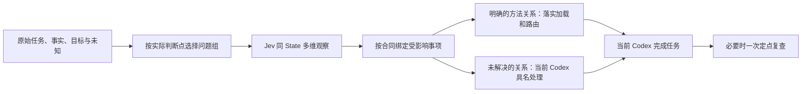

# #211 设计重审：让多维观察真正影响判断

版本：提案 1，2026-09-25；代码基线 `4f804a0e9`。**本文件是待验证的替换设计，不是已经上线或取得增益的能力。**关联 #211；历史设计与实验保持原样。审计与最终处置见同目录 README。

## Core / 判断与取舍

**需要调整。优先改“观察如何被消费”和“怎样测到增益”，保留有用的问题维度及实际执行约束。**现有结果没有证明 Jev 无用，也没有证明换一个更复杂的题组就会有效。

原 v0.2 设计已经写过“观察与行动分离、允许噪声、局部异议”；不能把这些再次包装成新发明。现在的实测暴露了实现与该意图的差距：关系评估把部分辅助判断变成整项放行条件，提案表示本身影响任务能否开始，复查曾继续评价用户原来的错误推论。同时，六题都从预置坏答起步，直接 Codex 已能检出，难以检验题组能否补足自然发生的遗漏。

新的可证伪假设是：**给原宿主补上有区分力的关系观察，并要求处理其中影响当前任务的发现，能够减少自然任务中的漏判；允许有依据地否定误报，能减少无谓阻断。**只提高路由放行数、输出更长或方法名更一致，均不算成立。

## Mainline / 责任与路径

### 1. 输入直接绑定原文，避免先造一份必须完美的提案

每个检查只需原文版本、用户有效目标/范围、所评对象及必要关系引用。S0 不生成完整答案；S1 加入真实当前候选，候选与来源明确分开。沿用现有 document/ref/hash，不新建知识图谱。

当前 `relationship-input.v1` 强制 frames/claims/edges/competitions 等完整形状，`q0` 对表示不可用会提前退回。K2 的预算与价差就在原文中，提案未完整承载仍挡住后续。拟在新 opt-in 合同中提供**原文直视图**：机械校验引用、版本和必需槽位；确实存在会改变判断的提案压缩时才审查这份提案。材料足够就按原文评估；原文真缺事实则保留缺口，不能把缺图字段自动当成事实不足。

LLM 提议的 actor/time/goal 等继续是待核对解释。对同一句话有多个合理任务框架时，不为 schema 逼出唯一标签；仅在它会改变下一动作时具名澄清/处理。不能把“可以不造大提案”变成“不必保留关系”。

### 2. 问题组覆盖决定性区别，每题必须有独立用途

复用现有合同与方法正文，优先等量替换。直接方法适用性仍是合法问题；没有必要把它全部拆成低层特征。复杂对象增加关系切面，但不按固定数量全量发问。

| 观察切面 | 示例问题（新合同拟定方向） | 可改变什么 |
| --- | --- | --- |
| 对象与处境 | 候选是否仍回答同一主体、时点、目标与范围？ | 恢复用户正在问的事；保留合法范围修正 |
| 支持范围 | 材料支持一次观察、局部机制，还是足以支持候选的整体断言？ | 保留局部真相，收回没有依据的推广 |
| 解释区分力 | 证据 E 对解释 H1/H2 是仅支持其一、两者皆可容纳，还是无法比较？ | 明确哪一事实真正区分方案；避免数支持票 |
| 条件与依赖 | 若关键材料失效，当前推论是否仍有独立依据？所缺信息会改变哪个动作？ | 条件化相关决定或具名取证；独立事项继续 |
| 方法贡献 | 同一事项里各方法提供哪个必要判断？已有产物能否复用？ | 落实主辅、读取与真实依赖 |
| 偏差后果 | 该遗漏只影响措辞/限定，还是会改变处理方向？ | 帮助宿主安排修正重点；不以分数抵消权限 |

这不是新增六个常驻关卡。每次绑定问题时声明作用对象、消费动作和真实依赖；不适用题可以不问，不能记录成已通过。模板选择本身也需测试漏激活；不能靠“Skills/4K”关键词或看到标准答案后选题。

Choice 描述关系类别；Noul 评估定义清楚的命题；Score 表示有锚点的有序影响等级。三者可同批，但不为了凑齐三种格式重复同一含义，不跨格式投票。Score 缺失可影响关注信息，不能取消必要方法。没有量化校准证据时保留原生不确定性，不称其为事实正确率。

**问题示例的边界：**上表没有提供可直接运行的完整题文/选项/金标准；实现时必须成套冻结。判案只用于检查设计能否区分“到场”和“实施”、相关证据和独立证据，不强行移植司法术语到 using-mindthus。

### 3. 将辅助观察与处理义务分开

每条观察绑定现有 `issue/check/source`，另在新政策配置里声明它是辅助信息，还是某个具体动作必须先处理的检查；声明由题目合同作者制定，在模型返回前固定。模型不能自己把未知降级为不重要。

- **辅助观察未知、低影响噪声、未激活的推测分支：**记录状态并继续不依赖它的工作。未知不改成否定或通过。
- **与当前动作有关的具名发现：**要求执行者处置：采纳并修正、引用原文/方法边界提出异议，或说明缺哪个事实及影响范围。②不能静默略过；①可以自行采用，但两者的后果都计分。
- **已知权限、必要事实或前置产物不成立：**限制依赖它的动作。现有宿主授权与产物接受权保持；未决必要依赖不能凭“容错”被消失。

`relationship_assessment.consume` 当前对所有已消费 `uncertain/unresolved` 直接 `return_original_owner`，需替换为上述作用范围。单个事项若整体依赖该未知，仍整项未决；不为了放行强拆成没有意义的小步骤。

`route_control.consume` 已能保留独立事项及 Score unknown，不应重复重写。需要单独验证的是同事项 M02/M03 的中间区间/冲突是否过度挡住主路线。`.8/.2` 仍只是开发政策，不能因放行率低就降阈值。本次最小切片中，该初始未决仍交回原宿主并计入未决；现有仲裁只有执行者提出异议后才可达，不能写成已有的“初始未决仲裁”。若证据要求增加这一入口，须作为后续新增接线、预算和测试，不能在本轮暗中实现。不同维度反向不是天然冲突。

### 4. 对“处理发现”施加约束，保留对结论的纠错能力

用户担心“最后又交给 LLM 随意忽略”，应保留实际加载、路线版本、消费回执和局部异议。①建议式与②约束式继续实测，不预先宣布②必胜。

②要求的是：执行已提交方法，以及对会改变任务的发现完成一次处理。**它不要求宿主无条件同意 Jev 的语义结论。**异议必须定位到题目、原文或方法边界；重大语义争议复用已有独立上下文仲裁一次，不能由提出者自批，也不引入常驻裁判。机械问题由代码解决。仍未决就记录受影响范围并交原宿主，不能冒称 Jev 成功。

轻微措辞、等效路线及不影响行动的观察差异由原宿主吸收，不逐项仲裁。必要纠偏在同一 episode/预算内发生一次；旧单题合同错误隔离和前置接受后只复查未决后继的两项修复直接沿用。

独立审计另发现当前路由入口在复查仍为 `request_correction` 时继续 dispatch；已在本轮做最小工程修复：该事项保持 `relationship_correction_unresolved`，关闭复查则为 `relationship_correction_unverified`；独立事项继续。前置产物被接受只能解决相应依赖，不能清除独立的关系纠偏未决。修复不增轮次、不强制所有观察变绿、不改历史回执，亦不代表上面的新观察消费方案已实现。

### 5. 复查只看改变后的相关关系

保留已实现的 v1.2“当前候选”绑定。新候选出现时，按输入引用使相关检查及真实依赖后继失效，其他观察保留历史有效范围。纠偏复查不得再次把用户旧论点当成候选立场；若修正没有解决目标问题，如实未决，不追加一轮追绿。

这里的“相关”须由题组合同声明语义依赖，不能仅看 quote/hash 是否改变：所有候选立场/质量检查随候选版本失效；处境判断随主体、时点、目标、框架变化失效；材料支持检查随所需原文/证据变化失效；合同语义改变时旧评估不移用。题目都能看到完整 State，引用字段不是访问隔离。只有明确不依赖已变部分的观察才复用；依赖不明时保守重评相应组。D 包含“用户原话未变但候选已纠正”和“引用未变但框架/目标变了”两类反例。

现有 route-control 前置接受后的定点复查已经实现；本节拟调整的是 legacy relationship 纠偏仍 `_judge(revised)` 全编译题组的部分，避免混为同一修复。任何变更建立新合同/政策身份，旧结果不能作为新版本实时回执重新消费。

## Example / Skills 与 4K 怎样体现价值

- Skills：范围更正可以成立；“因此只有提示词”仍需对象内证据。固定三句话确实足够的反例要保留；不能用虚构工具/工作流反驳它。
- 4K：物理像素差异可以成立；当前可用性改善也可以成立。把两者放在各自目标和时点下，检查谁影响当前决策；不要求结论统一偏向 4K 或 5K。
- 丰富观察的价值是让遗漏变得可见。如果纯 Codex 看同一问题清单就同样改善，价值主要在问题设计；若 Jev 只更快，应单列工程价值，不宣布达到本次判断增益门槛。

## Runtime support / 最小实施边界

下一切片仅替换实验内关系输入编译、观察消费和相关复查，挂在现有 entry/Session/CurrentAgentHost 下；保留原 profile 以便历史复核。三原语 provider、账本、预算、依赖接受、宿主实际加载均复用。

暂不扩展通用编排、重复采样、题组自动生成或新审计平台。默认非 Jev 技能不变。先用[测试计划](TEST-PLAN.md)证明题组及其消费有新增作用，再决定推广；不能以实现这份提案代替证据。

## Guardrail / 保护哪条主路径

以下约束保护“多维观察改善实际判断”主路径，不承担新的总裁判职能：不同问题不代表独立证据；原生分布不证明事实；丰富观察不证明遗漏清零；通用 LLM 仲裁也会错；高风险权限与不可替代的前置证据不参与容错平均。**按合同执行检查和记录处置是可以用程序验证的工程目标；软件仍可能有漏洞，语义检测和纠偏也没有 100% 正确保证。**

## 十条原则逐项落点

| 原则 | 当前差距/须保留部分 | 本提案与验证位置 |
| --- | --- | --- |
| 1 实际后果 | 方法名、放行与任务结果易混淆 | 逐题记录实际决定与 win/loss；TEST-PLAN 指标 |
| 2 相关 State | 强制提案可遗漏已有原文；旧候选绑定已修复 | 原文直视图；S0/S1 分开；原文完整性反例 |
| 3 连贯维度 | 不能把所有判断降成碎片，也不能只要总裁决 | 高层关系题＋直接方法题；删题消融 |
| 4 自描述合同 | 题文与消费规则应联合版本化 | 作用范围/处理义务在结果前固定；正反例 |
| 5 定点纠偏 | legacy 消费仍可整项退回 | 辅助 unknown 不当全局门；必要问题仍限制动作 |
| 6 合批与依赖 | 同 State 已合批，关系复查仍全编译 | 复用有效观察、只失效相关引用；不宣称计费优势 |
| 7 类型与未知 | route-control Score unknown 已正确保留；关系题主要 Choice | 按维度选择原语，未知单列；不硬凑三种格式 |
| 8 消费与权责 | 观察与动作条件易混同 | 约束履行、具名异议、保留事实与权限所有者 |
| 9 资格与反向控制 | 合成预置坏答＋非盲作者评分上限明显 | 自然草稿、正确/条件答、问题清单对照、盲评 |
| 10 有界复用 | 不应为每个失败再叠一层机制 | 一个共享预算、一次修正、一次局部复查；无采样器 |

## Boundary / 如何否定这条新路线

若独立新任务里纯 Codex 与 Jev 辅助同样好，且问题清单对照已解释改善，停止声称 Jev 带来额外判断增益；若②放大错观察或无谓阻断，缩回①或更窄作用范围；若有效覆盖下降、严重错误增加或 Skills/4K 没有可重复改善，本版不进入默认路径。可以保留题组资产和路由速度证据，#211 资格仍未通过。
