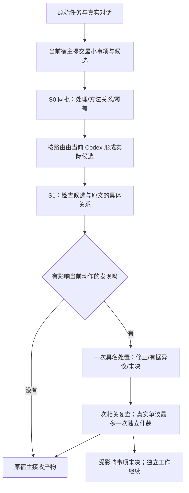

# #211 修正设计与实施顺序

日期：2026-09-26。父代码：`3dcb930c3a391acf67ecf078975dc3acffd004ac`。
状态：**待实施设计；没有新运行结果。**关联 [全链审计](FULL-AUDIT-20260926.md)。
2026-09-26 更新：v0.3 的实现代码已写入实验分支，见
[接管说明](IMPLEMENTATION-20260926.md)；用户本轮要求暂缓测试与审计，所列验收和实测步骤
仍未运行。本文件的顺序继续作为后续实施与验证边界。
本文接替 PROPOSAL/TEST-PLAN 中尚未执行部分的实施顺序；旧实验、分数、冻结和失败记录保留。
下文 D/N 沿用旧计划的“开发阶段/新来源阶段”，不是场景编号；场景仍为 A–F，方式仍为①/②。

## Core：这次具体要修什么

**让 Jev 在真实任务的决策点提供有用判断，并让宿主必须处理会改变任务的发现；用真实
多轮任务验证最后的选择是否改善。**不以“调用过 Jev”“所有回执齐全”或“多写了一句限定”
作为有效的替代指标。

保留当前 Codex 负责理解任务、提出解释和完成工作。Jev 评估材料之间的关系及处理选择；
代码负责版本、范围、方法读取、处置义务、预算与恢复。语义上谁判断正确，由独立任务评分
检验；不能由 Jev 自己的复查通过来证明。

最小变化是三个：

1. 输入保留真实消息与原文；宿主填写的对象、目标和候选方法保持“推断”身份。
2. 新观察接入已有 `entry → Episode → CurrentAgentHost`，每项必要发现有实际终点。
3. 将“原问题复现”“共同候选纠偏”“完整路由效果”分开测试，并补齐五个对照条件。

继续使用官方 TypeSafe `jev-1.13.0` 和当前 Codex；不调用 CPA/OpenRouter。
费用按用户要求暂计 0，实际账单未知单列；主要比较判断质量，耗时只比较路由模块。
不修改 main，不改旧 OCI 路径/hash，不重跑旧请求补迁移缺项。两项已修根因直接保留：
单题错误隔离、前置接受后仅复查依赖它的未决后继。

## Mainline：按这个顺序实施

| 顺序 | 交付物与改动 | 通过什么才进入下一步 |
| --- | --- | --- |
| 0 恢复目标 | 两条原始 Skills/4K 多轮轨迹、当前 Codex 自然首答、按真实决定写的验收点 | 来源/角色/轮次明确；新首答没有被作者改坏；缺失历史明确标缺失 |
| 1 固定合同 | 薄输入、新观察题文与选项、每题动作后果、①/②处置规则 | 每条题能说明改变哪个动作；正反例区分合理；金标准不进入模型输入 |
| 2 接回运行时 | 新 opt-in 模式、原 Episode 预算、CurrentAgentHost 新回复合同、局部未知与终态 | 离线错误路径和中断恢复通过；旧两项根因回归不倒退 |
| 3 原题小范围实接 | 两条历史任务的共同候选五条件诊断，及两条 Jev②完整路径 | 真实请求→发现→处理→复查→原宿主接收可追；正确/错误语义另判 |
| 4 新来源 E/F | 先跑 4 个冻结家族：Skills 2、显示决策 2；五条件完整路由 | 没有未修工程缺陷；观察到值得继续检验的实质改善，或仍有事前写明的机制疑问 |
| 5 扩到 A–F | 再跑预先冻结的 8 个家族：A–D 各 1，Skills/显示各补 2 | 整体有效覆盖与错误不恶化，难场景改善可重复；否则报告不支持扩散 |

步骤 0–3 是开发与接线验证，不取得产品资格。步骤 4 平手但已无可区分机制时，停止扩大
实测；这不是以代理题平手阻断真实目标测试。若因为天花板或关键分支没出现而继续，必须
使用调用前已登记的后续家族，不能临时筛纯 LLM 会失败的题。步骤 5 是实验扩展，默认技能
采用是另一个决定。12 个家族也只支持方向性判断，不声称统计非劣或全面资格。

## 0. 先恢复真正要解决的问题

### 0.1 两种轨迹分开

- **历史轨迹重放**：原用户首问、原助手答复、原用户范围纠正/追问，逐条保留作者与顺序。
  用于复现当时的判断压力；历史助手文本不冒充当前 Codex 首答。
- **当前自然轨迹**：从原始首问让当前 Codex 自己回答，再接适用的原用户后续消息。
  若后续消息批评的行为在新首答中没有发生，标为不适用，不能硬接以制造错误。

完整历史取得不到时，使用现有来源片段仍可做开发诊断，但明确缺失内容；不让 OCI 是否
在线成为运行条件，也不补写“原始助手”文本。历史引用优先从
`entry-assessment/original-scenarios-design/source-packet.md` 和
`docs/cases/2026-07-05-decision-context-calibration-display-scaling.md` 回溯。

Skills 观察的是：接受“只讨论 Skills”的合法范围后，是否仍独立判断“因此只是提示词”
这个推论。4K 观察的是：在原事实和当事人处境下，是否给出当前有用的选择，并保留物理
限制；从已有设备补救切到购前选择时，是否相应改变主判断。

旧六个短题保留为组件回归。旧 K1 的“预算未知必须成句”不迁入新金标准：必要未知须
说明它怎样影响当前行动。文字完整性可以单列，不能自动判成实质错误。

### 0.2 验收材料与运行输入分离

每个来源在运行前登记：原始消息/来源、实际用户义务、可接受决定集合、重大错误、必要
未知及其影响、允许的等效方法。**正确 frame、预期路线、命中项和评分点只给评阅者。**
不要求唯一方法名、固定句式或统一支持 4K/5K；判断依据与行为后果才是验收对象。

## 1. 实现：原文与推断分开，题目对应具体动作

### 1.1 新入口与输入

新增实验模式 **`route-control.v0.3`**，在现有模块内做窄的版本分派。旧模式/冻结使用旧
合同；新模式不要求构造 legacy `frames/claims/edges/competitions` 完整提案。

沿用 document/ref/hash、issue、dependency、authority 和 task_budget：

| 数据 | 内容与来源 | 使用规则 |
| --- | --- | --- |
| 原始材料 | 带 role、顺序、版本的用户消息、历史助手文本、来源文档 | 模型看到相关原文；不以人工摘要替代争议所在的轮次 |
| 明确约束 | 原用户目标、范围、权限及其引用 | 不把用户事实主张升级为已证实事实；合法偏好保持约束地位 |
| 宿主提议 | 当前 Codex 提出的 issue、候选方法、可选 actor/goal/scope | 标注 owner、source refs、`host_inference`；允许 unknown；不得当作金标准 |
| 当前候选 | 实际生成的框架/计划/回答，独立 ref/version | S1 必需；S0 没有时不伪造，也不评价尚不存在的回答 |
| 已接受前置 | 现有 accepted artifact 与用途回执 | 仅在接受的用途范围内复用，沿用旧后继复查机制 |

包装、引用检查由代码完成。当前宿主已有的 issue/candidate 提议直接提交，不为每次入口
额外调用一次 LLM。确实缺少最小投影才用已有唯一 organize 槽；组织者的实际工作、输入
和成本记录下来。首版仍保留现有有界事项/候选容量，不承诺任意自然语言自动编排。

候选遗漏不能静默消失：S0 的**覆盖题**同时读原任务、全部已提事项和 canonical 方法轻
目录，判断“是否遗漏改变当前处理的事项或必要方法候选”。`missing/unclear` 只使受影响
事项未决，`covered` 不等于穷尽证明。首版不自动补候选再递归问一轮；宿主接管单列为
fallback，计入系统效果。输入准备造成的遗漏也算系统失效，不能从 Jev 路由分母删除。
已列事项按 issue 绑定覆盖题；全局剩余范围检查若发现遗漏新事项，绑定原请求的
`unassigned_scope`，不能伪造一个现有 issue ID。定位不出影响范围时交原宿主并保留未决，
不能由代码猜测哪些动作可以不受影响。

### 1.2 检查发生在哪里

S0 复用既有 G/M/R 方法语义与真实依赖。S1 采用原文直读观察。二者在同一 Episode 内，
不是两个各自补满预算的实验。已有必要前置接受仍可触发一次相关后继判断。

本轮每个实验 Episode 只选**一个事前冻结的真实介入点**：例如第二轮用户纠正后、宿主
尚未生成本轮答复时。之前完整对话作为带来源的前缀，后续本轮从 S0 跑到产物接收。
这保留多轮形成的判断压力，尚不测试每轮连续启用 Jev 的长期效果。新生成前缀的工作也
入批次总账；一个已经活跃的任务不能换 Episode 伪装新介入点来重置额度。本轮不在同一
Episode 的两个用户轮次各跑一套 S0/S1；未来若测连续介入，须先重定总预算与测试范围。

实验窗口内，所有语义任务都进入 S0 的有界处理/覆盖检查，以测出应直接执行、需要事实、
需要方法及遗漏。代码明确可解的确定性任务可零调用并记录原因。S1 对实验范围内实际
生成的判断候选运行预登记的适用题；不由宿主先填 `frame_risk=True` 才能发现自己的盲点。
这是 opt-in 测试配置，不是默认所有对话全量扫描。未检查保持 `not_evaluated`。

### 1.3 最小题组及动作合同

实现时给下表每项完整题文、互斥选项定义、来源版本与至少一正一反例。优先改现有四题的
对象绑定和消费，不新增六套常驻关卡。S0 关系与 S1 候选检查不能偷换对象。

| 检查 | 实际比较什么 | 关键结果与动作 |
| --- | --- | --- |
| S0 处理/方法/覆盖 | 当前请求、方法正文、宿主提议与遗漏 | 直接执行/取证/具名方法；缺必要候选则局部未决，不能假定人工候选永远正确 |
| 范围与处境 | 最新请求、此前助手判断、当前候选所服务的主体/时点/目标 | 对齐→继续；范围被忽略/目标被替换→恢复当前任务；确实歧义→只澄清改变行动的部分 |
| 解释支持范围 | 候选具体断言与其所引材料；局部机制是否足够支持该断言 | 支持充分→保留简单解释；推广过度→保留局部真相并限定结论；不适用/材料不足分开 |
| 主张来源与支持 | 哪段是用户主张、哪段是候选自造，证据支持哪一个 | 未证实用户主张被当事实/候选新造事实分别处理；合理偏好和范围不能判成错误前提 |
| 证据与当前决定 | 当前行动依赖的材料/未知是否真的改变选择 | 足够→继续；缺少必要条件→具名取证或条件化；遗漏关键已知→修正；非决定性缺项不阻断 |

每个 finding 至少带现有的 `issue_id/check_id/value`，再绑定 `target_ref/version`、
`source_refs`、`state_hash`、`affected_action`。这里的引用直接来自该题实际比较的材料，
不是事后编理由。优先用消息/段落粒度；未做更细定位就不谎称 Jev 找到了某个词句。
Jev 可以继续返回 Choice，不要求它生成自由文本理由。宿主的修正/异议再引用实际片段。

**Skills 示例：**比较用户“只讨论 Skills”这一轮、此前助手对 Agent 整体的回答，以及新
候选是否仍借 Agent 能力反驳；另检查“所以只是提示词”是否由对象内材料支持。这两项
可以一项成立、一项不成立，不能合成“用户对/错”一个开关。

**4K 示例：**比较“已有设备怎样先用顺手”的当前请求与候选的购买建议。物理 PPI 不变
可以约束“不能等价 5K”，不能自动否定软件可用性改善。若下一轮改成购前少妥协，重新
评估对应目标；不照抄上一轮“先别换”。

同 State 且输入独立的题合批；真实新产物/新事实才进入下一批。所有候选质量题随候选
版本失效，不能只检查引用文本是否变了。没有必要的 Score 不加入；旧 .8/.2 不为追放行率
下调。同一维度的噪声不能靠“全部 advisory”永久掩盖：先用正确前提/错误前提/候选自造
三类反例验证，再固定该题的处置政策。

## 2. 实现：让②有真实处置终点

### 2.1 完整保留发现，未知限制到所依赖动作

删除“命中 evidence 就只给 evidence”这条优先规则。多条发现可共用一段修正文本，但
处置表必须覆盖每个 finding ID。首版仅合并完全相同对象/维度/版本的重复记录；不再新增
一个语义去重模型。宽泛标签不自动吞掉独立的范围或解释义务。

方法适用性的未知与执行当前主路线必需条件的未知分开：

- 明确主方法＋仅辅助贡献未知：保留主路线，支持项不强制加载；未知留在报告中。
- 同一事项的真正主导权冲突、必要事实/授权/前置未知：相关动作保持未决。
- 无法判断未知是否影响主路线：保留该事项未决，不靠代码猜它无关。

必要性应由已有方法合同及明确依赖决定；确需语义区别时在同一 S0 批次增加一项作用范围
Choice。不能由消费器看到不利结果后自行将它降为辅助。未定伴随关系不能无条件清空已定
主方法；依赖它才限制相关路线。不把“不确定”改成 false、PASS 或无故全批阻断。

### 2.2 ①与②的明确区别

两种方式收到同版本观察、相同原文/方法材料，拥有相同修正上限。

①的 S0 观察不自动形成方法承诺或新增阻断义务。它使用同一个运行时的 advisory 消费分支，
不套②的 committed-method 校验来禁止合理改路。②才提交方法/处置义务并执行对应校验。
真实权限、已知必要依赖与既有必须执行的规则对两者相同。消费方式在调用前冻结，不能
看到不利结果再切换；接收与预算校验两者都保留。

- **①建议式**：宿主可以不采用观察；保留实际最终产物与未采用项，按后果评分。实验记录
  可以在事后补标签，但不能提前要求逐项处置，把①悄悄变成②。
- **②约束式**：每个必要 finding 必须提交 `修正 / 有据异议 / 未决` 之一。修正要指向新
  产物及改动位置；异议要指向原文/方法边界，说明哪项发现为何不适用；未决要指出影响
  哪个动作。非空字符串、方法名单或一句“我不同意”均不足以解除义务。

语法校验只能拒绝缺引用、错版本、漏 finding、无产物等机械问题。引用存在并不证明异议
正确；影响当前动作的语义争议由**一次独立上下文仲裁**处理，同一宿主不能自批解除。
沿用当前 Codex，不引入 CPA。没有独立上下文/预算或仲裁仍不确定，就保留未决。
仲裁若有据解除误报，不再让同一条 Jev 旧观察自动否决该裁决；只有新的材料/候选改变了
原裁决对象，才按剩余额度处理，不能因此重开纠偏循环。

### 2.3 状态与预算

| 事件 | 代码必须留下的状态 |
| --- | --- |
| 发现进入② | `pending`，绑定原候选、受影响动作和全部 finding IDs |
| 宿主提交修正 | `revised_awaiting_recheck`；原报告继续保留 |
| 复查消费结果允许该动作，相关必要发现/阻断未知已合法处置且原宿主接收 | `resolved_by_revision`；保留复查及接受回执；未检查/技术失败不满足此条件 |
| 有据异议获独立裁决解除，原宿主接收 | `resolved_by_objection`；记录裁决及实际采用产物 |
| 无据异议、漏处置、复查仍命中、预算耗尽 | `unresolved`；不能写成已通过 |
| 技术失败/未执行 | 单列 `technical_failure / unrun`，不等同语义错误或成功 |

`resolved` 说明消费合同闭合，不证明语义绝对正确；独立评阅仍可判误改或错误解除。
最终回执绑定实际答案、route revision、检查结果和剩余义务。没有回执就只能写“候选已
生成/复查已返回”。接受操作可只是原宿主确认现有产物，不要求再生成一份答案；如实际
新调用了模型，必须计数，不能说回执天然免费。

沿用 Episode 的 reservation/intent/outcome 和锁。每个新任务 Episode 上限：

- judgment ≤4：S0 一批、S1 一批、候选修正复查至多一批、真实前置接受后的后继至多一批。
- organize ≤1、correction ≤1、arbitration ≤1；S0 已用纠偏额度，S1 不重新获得一次。
- execution 沿用每事项至多两次尝试；本批 task_budget 普通事项最多 2 次，双节点接力
  最多 3 次（两个原始执行＋一次必要接收/重执行）。总上限先固定，不能每节点各开新预算。
- 现有 `total_requests` **不含 execution**：四次判断＋组织＋纠偏＋仲裁共≤7，另列实际
  execution 和终态接收的工作量。不得将它报告成“全部工作总共只有七次”。

若终态接收需要新模型请求，使用既有 **execution 槽**，新模式增加窄的 `accept_only`
请求子型，回复只可接收/拒绝已绑定产物，禁止更改内容。它占普通 2 次/D 接力 3 次额度，
不额外另开槽；不足时保存待接收状态。没有新模型请求的真实宿主接受回执作为已有产物的
接受事件记录，实际工作时间另记；不能由 runner 冒充原宿主确认。

所有槽位共用**最多一次实质修订**的约束：路由仲裁后若重执行替换了同一用户决定的已成
候选，也占这次机会；S1 不能再获纠偏。不同 DAG 节点按预登记合同首次产生各自产物不算
重复修订。接收不改答，技术补充保持原请求；不能把第二次纠偏改名 execution 绕过上限。

仲裁后不再启动第二次具名纠偏循环或第二次候选复查。若裁决需要的新答案尚未得到合法
检查，必要义务保持未决。仲裁前主结果先封存，仲裁后改善单列，不能混成①/②政策净收益。

### 2.4 改哪些现有代码

| 文件/位置 | 最小改动 |
| --- | --- |
| `experiments/typed_decision/entry.py::run` | 新 opt-in mode 分派；不让独立 runner 绕过入口 |
| `observation_assessment.py` | 新版本编译/消费函数：原文/推断来源、对象绑定、全 finding 传递、作用范围；保留 v3 历史函数语义 |
| `route_control.py::{validate_input,compile_route,consume,run}` | 薄输入适配、S0 覆盖、辅助未知局部化、S1 接线、②终态与接受回执；复用方法加载/执行/依赖 |
| `relationship_runtime.py::Episode.tally` 等 | 显式允许新模式的 current-host pending；共享原计数与预算，不能漏算 awaiting 请求 |
| `current_host.py::{_reply_shape,_validate_reply,submit_response}` | 按 mode/request schema 分派新纠偏/异议校验；新回复不伪装 legacy proposal；接收终态回执 |
| `relationship_live.py` / 既有 admission | 给新问题合同、政策、宿主和预算绑定新身份；不放松旧验证 |
| 新版本配置及一个薄实验入口 | 冻结 source/question/policy/code/host 身份；仅负责分派、现有记录与汇总，不重造状态机 |

`CurrentAgentHost` 当前没有 organize role，若缺投影分支需要它，应显式新增该角色和唯一
组织回复校验；不能用 correction 角色顶替、漏记额度。`pending_request` 的 45 秒上限与
Episode 单步配置要一致校验；若为已知环境问题调整时间，只在新 profile 和冻结中显式改，
不隐藏超时、不改变旧记录。

### 2.5 新运行可移植，旧账本保持原样

新运行从参数提供 repo/state root/Codex 可执行文件，CLI 可用 PATH 发现；密钥来自现有
安全环境，不写配置明文。运行根目录建在代码仓库外，冻结后仍绑定它的实际绝对路径。
跨机器新运行建立新 run 身份并记录父版本，不移动旧 Episode 冒充继续。

manifest 分开记录代码 commit、实现文件摘要、题文/政策/方法来源摘要、宿主配置、实际
可观察型号。读取历史报告使用其冻结身份；当前 checkout 多一个文档提交不应阻止只读
报告。恢复执行仍严格核对真正影响执行的摘要和身份，不能通过改写路径/hash 绕过。

不再通过修改父 runner 的 ROOT 复用；不复制三套 freeze/host/recovery 框架。准备、运行、
恢复、报告均调用同一现有运行时，旧脚本只服务旧记录。

## 3. 测试：先证明接线，再证明判断改善

### 3.1 必须先过的离线反例（零 Jev）

| 组 | 关键验证 |
| --- | --- |
| 输入与激活 | S0 无候选合法，S1 无候选拒绝；真实历史/推断身份保留；未激活不记通过；遗漏事项/候选可见 |
| 发现 | 三个可处置维度同时存在不被 evidence 吞掉；候选自造与用户前提分开；正确简单解释不被强行扩大 |
| 未知 | 主路线明确＋辅助未知继续；必要依赖/真正冲突未决；不相关事项能继续 |
| 处置 | 漏 finding、空泛异议、错来源、错候选拒绝；有据异议不能自批；复查仍命中不能结束为成功 |
| 有界恢复 | 中断重入不重复请求；pending 已占额度；纠偏/仲裁跨轮不重置；旧结果与新版本不混用 |
| 已有能力 | 单题无效不拖垮合法题且保留原始返回/用量；接受前置后仅重判未决后继；未决纠偏不被前置接受清掉 |
| 便携性 | 临时目录/不同 repo 路径的新运行正常；旧根目录不重写；只读历史报告不依赖当前文档 HEAD |

使用具体行为断言，不写只证明字段等于自己赋值的镜像测试。运行现有相关测试集和新增
反例；新 mode 影响公共入口/账本时再跑受影响的集成回归。工程门不要求 Jev 在语义题上
胜过 Codex，也不要求所有不确定变绿。

### 3.2 历史 D：共同候选诊断与真实接线分开

对两条历史目标，先保留当前自然候选，再恢复同一完整历史，运行五种 S1 处理：
纯 Codex 复核、只给问题清单、Codex 观察②、Jev 观察①、Jev 观察②。
此时 Jev①/②初始 State 相同，可以共享一份初检；分支改写后分别复查，不能共享。
Codex观察②也使用这份完全相同的冻结 State/题文：同一自然候选、完整历史、宿主推断和
引用；不各自重新 organize，不由作者纠正 frame。这提供的同输入后端证据仅限两个历史
快照；宿主分支产生新候选后复查不再是同输入比较。

另让两个目标经新 `entry` 完成 S0→宿主→S1→必要处置→接收，使用真实当前宿主。
这是接线验收；五条件共同候选实验回答的是纠偏机制，不冒充完整路由比较。
D 至少有一次由当前任务的真实宿主通过 handoff 接收/提交。N 可由隔离 Codex 实例各自
担任分支任务宿主，使用相同配置、完整任务历史和真实 context ID，并在同一 Episode
持续接收后续事件；不能把一次 disposable CLI 改写称为父会话的连续宿主消费。
受控错观察、正确观察被忽略、无据异议等用 fixture 注入测宿主行为，明确标 synthetic
injection；这些不是 Jev 的真实误报率。

### 3.3 新来源 N：五条件完整路径

预先登记 12 个来源家族，先 E/F 各 2，再 A–D 各 1＋E/F 各 2。场景一直叫 A–F：
A 日常处理，B 单方法诊断，C 主辅协作，D 阶段接力，E Skills，F 4K/显示处境。
条件使用中文名称；方式只叫①/②。旧六题中的 A–F 编号不得覆盖这份场景分类，引用旧题
同时写批次/原 ID。

收集来源和事前评分由不看后续模型结果的步骤完成。每类保留反向控制：简单解释确实
充分、合法范围收窄、5K 确实更适合购前目标、事实真的缺失，以及不必调方法的任务。
不按纯 Codex 是否出错筛选，不把同一题改写成多个独立来源。AI 合成来源只叫开发材料，
不能标真实来源/未暴露外部保留集。没有足够真实材料时明确降低结论范围。

| 条件 | 完整路径中的操作 | 与谁比较、能说明什么 |
| --- | --- | --- |
| 纯 Codex | 原任务和方法资料，自然定框/选路/回答，允许一次自复核 | 主产品基线；另保留复核前自然首答 |
| 问题清单 | 同一任务及同样资料，得到未填答案的同版问题，然后处理/复核 | 与纯 Codex 比，检验题目提醒与相应准备的整包作用 |
| Codex 观察② | 同版合同由独立 Codex 上下文给观察，当前宿主按②处理 | 与 Jev②比，检验同合同路径；准备输入差异须另列 |
| Jev 观察① | Jev 观察，宿主按①处理 | 与 Jev②比，检验消费方式；不得暗增修正机会 |
| Jev 观察② | Jev 观察，宿主按②处理 | 事前固定的主候选，不在揭盲后选赢家 |

每个条件从相同**原始对话前缀**和方法资料出发，后续由自己的宿主形成真实框架/候选。
后续请求在运行前冻结为各分支均适用的共同消息；若确需交互选择，则预先冻结同一选择
政策和共同任务终点，不由操作者看结果后选追问。原历史追问若在某分支不成立，保留全部
分支及原因，该轮不作同题配对 win/loss，不能删除不利分支后重算优势。
分支相互隔离，恢复完整消息与此前助手判断；模型不能看到其他分支答案、期望方法或旧
改正文本。版本、思考档位、工具、输出额度、修正上限相同，执行顺序提前平衡。

不能强制完整路径共享作者 frame 或另一分支的 S1 候选。**只有 State、题文和语义依赖
完全相同的初始观察才共享**；否则分别计请求。完整路径 Jev②与 Codex②的差异可能包含
各自准备/候选的随机差异，报告整包效果；同输入后端归因由 D 共同候选对照提供，必要时
在冻结新来源的同一实际快照上做预登记的配对组件检查，不能事后挑赢的例子。

五条件均有一次修正机会，及最多一次有原文依据的局部争议仲裁机会。先封存仲裁前的
结果，再记仲裁后的整包结果和额外工作。代码接不上某个条件就记未运行，不能引用历史
别批产物凑齐。②真实初始未决而不能执行的事项也进入分母。

### 3.4 调用与时间预算怎样落地

本设计不发起新请求。后续实施按以下配方一次写入新批次 admission；已有授权足以继续
内部修复，不为每题再问用户。旧批剩余额度不迁移、不重置。

| 阶段 | Jev 上限 | 当前 Codex 与宿主工作上限/口径 |
| --- | --- | --- |
| 步骤 0 自然复现 | 0 | 两条轨迹各最多两次自然答复，共 4；历史重放若另运行，至多 2 次，单列 |
| D 共同候选五条件 | 6 | 两来源：5 次宿主处理/来源，Codex 观察初检＋复查≤2/来源；共≤14 次主执行；真实仲裁/接收另占下述槽 |
| D 两条完整②接线 | 6 | 每条≤3判断；没有前置接力就不预留后继槽；宿主受 §2.3 限额 |
| N 首四个 E/F | 24 | 每来源五条件；Jev①/②各≤3判断；Codex观察②≤3判断；宿主分别受 §2.3 限额 |
| N 其余八个 | 50 | E/F 四个及 A/B/C 各一个：每来源两种 Jev 方式各≤3；D 一个各≤4，合计42＋8 |

上述 Jev 主上限共 **86**（D 12＋N 74），不假定完整路径一定能共享初检。
普通 E/F 每条完整路径≤3次，未触发纠偏时≤2次；能合法共享的初检只调用一次。
实施冻结继续按实际任务图删除不适用槽位，不能将 86 次当预定工作量。

Codex 完整路径每条件最多：组织 1＋首次执行/必要重执行/模型接收合计≤2（D 场景≤3）
＋纠偏 1＋独立仲裁 1；只有 Codex 观察②另有≤3次观察（D 场景≤4）。已有宿主准备不
额外生成调用；任何新增模型工作占对应槽位。评分每来源两个隔离评阅上下文，分歧最多
第三个；同一次评阅看该来源全部匿名条件。新来源前缀生成每家族≤2次，缺失原始资料
不能用该额度伪造。实际冻结必须列出这些数，不能只封顶 Jev、漏算普通模型与宿主工作。

技术预留只分 D、N 首四个、N 后八个三个阶段，每阶段 Jev/Codex 各≤2次；步骤0另给
Codex≤2次。故 Jev 含技术预留总上限 **92**，不是对旧批次的追加。每个失败请求最多
一次技术补充。优先恢复已有完成结果；外部 intent 尚在途或状态未知不重发。
首次失败保留；答案不理想不属于
技术失败。调用后若改变题义/政策，建立新版本，暴露来源降为开发集。

路由计时拆为准备、观察、宿主消费、修正、复查与仲裁；全任务生成时间另外列。
配置请求型号与服务端可见身份分开，不凭客户端设置宣称后端证明。设计/取源/评分也列
实际工作；没有数就记未知。这里没有重复采样投票或计费探针。

### 3.5 判分、晋级与停止

主比较固定为 **Jev②对纯 Codex 自复核后的产物**；同合同 Codex②、问题清单和①分别
提供解释。独立评阅先看原任务、事前验收点和匿名产物，分别评分后再揭盲；有分歧保留
双方记录。多个 Codex 上下文提供独立审阅视角，不冒充独立事实来源或跨模型证据。

每条件按完整来源家族报告：

1. 当前行动/路线有效数；错误、未决、技术失败、未运行分别列；等效路线允许通过。
2. 实际任务产物是否有效；仅方法名正确、回执齐全不算语义正确。
3. 发现→处理→宿主采用→行动改善的具体链条；无变化、无谓改写、误报伤害也列出。
4. 必要未知错误放行、不必要阻断、真实错误漏检；辅助措辞遗漏单列。
5. ①忽略正确观察与②机械服从错误观察；仲裁前/后和 fallback 分开。

小批晋级要求：Jev②对主产品基线与同合同 Codex②均未观察到有效覆盖降低或新增严重
错误；E/F 至少两个独立来源有实质 win，另一类及反向控制无抵销退化。同时公布相对
问题清单的差异。只有比清单也有改善，才支持观察带来增量；若与 Codex观察②一样好，
可支持该观察路径有效，不能宣称 Jev 特有准确率优势。

若只有当前纯 LLM 已经全部答对，报告天花板；若清单和 Jev 同幅改善，报告题目设计的
贡献；若 Jev 更快但判断不变，只报告路由工程收益。新来源全平手不证明普遍无效，也
不能成为无限改题理由。最多一次按具名缺陷修订后在开发回归核对；保留集一经暴露不重当
新证据。严重误改/权限越界/接受错误前置时停止该分支，先修实际缺陷。

## Runtime support：具体提交顺序与最终交付

1. **来源与合同提交**：两条轨迹及验收说明、新版题目/政策、输入与回复示例。先独立审
   题义和评分，再写实现；这一步不改分、不发 Jev。
2. **最小实现提交**：v0.3 版本分派、完整发现处置、现有宿主/预算接线、局部未知。
   一起带新增反例与相关回归结果，不提交仅有新 runner 的“完成”版本。
3. **接线实测提交**：冻结 D，运行真实当前宿主，保留完整调用与接收状态；独立核对原始
   请求、版本、实际采用和剩余义务。
4. **新来源比较提交**：预登记 N 全部来源和条件；先四个再决定后八个，阶段停止原因写明。
   不靠更换金标准或不利样本追绿。
5. **结果与处置提交**：工程、真实模型、宿主消费、比较结论四份口径；未运行/部分完成/
   未决/通过分开。默认启用需另有足够收益证据。

## 独立设计复核

`independent_architecture_review` 与 `independent_evidence_review` 两个既有独立 Codex
上下文只读复核草稿及修订。架构意见补入①的自由选路分派、终态接收占原执行槽、遗漏事项
的原请求范围、单介入点预算、合法解除条件，以及跨槽位一次修订。证据意见补入共同任务
终点、D 完全相同 State 与新旧候选复查的归因范围。两者在修订后均未发现残留实质问题。

这是设计合同的复核结论，不是实现验收、模型效果或正式资格。当前文档改动已做差异检查；
没有修改运行代码、执行工程测试或新增实验模型请求。

Gate Probes：本文承担可实施的设计责任。已定位问题是任务代表性、观察作用与消费闭合、
比较归因；本次只写方案，不把待实现字段、测试上限或审阅认可当成已经实现/通过。
下一步按提交 1→2 完成最小替换，再运行 D；不继续修饰旧六题结果。
