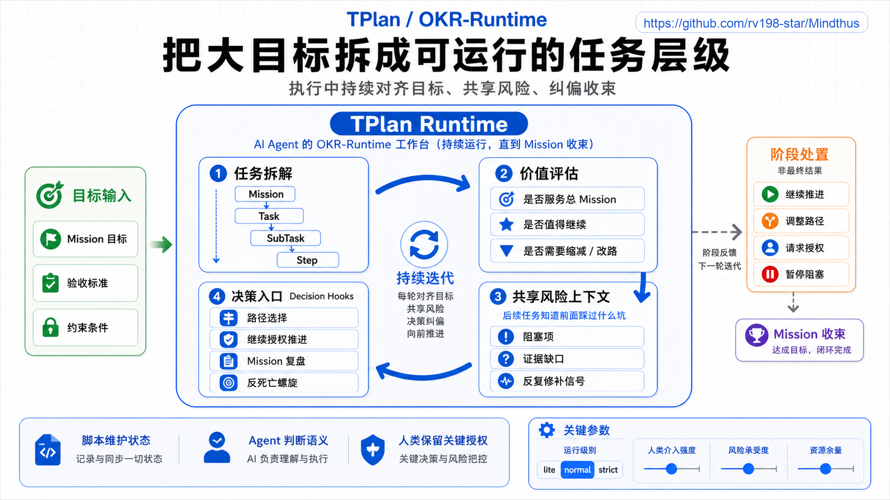
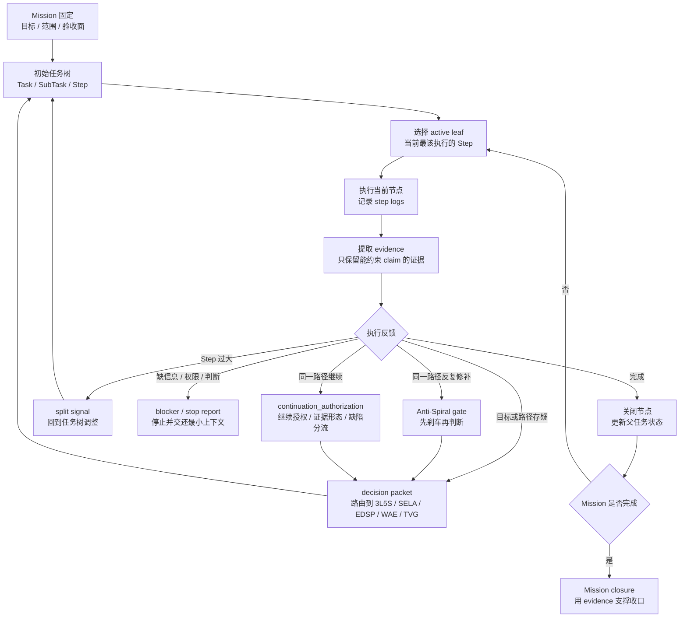

# tplan / OKR-Runtime

## 这是什么

`tplan` 是给 AI agent 用的 OKR-Runtime：把稳定 Mission 转成任务状态、验收证据、决策钩子和可恢复执行。



项目地址：<https://github.com/rv198-star/Mindthus>

如果说 OKR 帮人类团队把 initiatives 对齐到 objectives 和 key results，`tplan` 就是帮 agent 把长任务对齐到 Mission 和 acceptance evidence。它不是普通待办清单，也不是把任务写得更长的格式工具，而是给 agent 一个可以恢复、检查、停止和决策的运行时。

术语上可以直接和 OKR 对齐，作为对外主口径；`tplan` 的名字不变。当前 runtime/schema 仍保留 `Mission`、`evidence`、`task tree` 和 `decision hook`，不是为了兼容旧用户，而是因为这些词承载了 agent runtime 里 OKR 原词没有覆盖的状态恢复、证据约束和决策权限语义：

- `Mission` 对齐 `Objective`：稳定目标，说明这轮长任务到底要达成什么。
- `acceptance criteria / acceptance evidence` 对齐 `Key Results`：验收面和证据，说明目标是否真的更接近完成。
- `Task / SubTask / Step` 对齐 `initiatives / actions`：承载行动，而不是替代目标。
- `checkpoint / evidence / blocker / decision hook` 对齐短周期 `check-in / review signals`：让运行时能及时调整任务树。

这样对外可以直接说“tplan 是 agent 的 OKR-Runtime”；对内先保持 `Mission`、`evidence`、`task tree` 和 `decision hook` 这些更适合 agent runtime 的精确术语。未来如果进入 schema v1 级迁移，可以再考虑把 `objective / key_results / initiatives` 做成一等字段或正式别名，但那应该作为 schema migration，而不是文档措辞顺手改名。

它也比普通 OKR 管理更动态。普通 OKR 往往按周、月、季度复盘；`tplan` 的迭代周期可以短到一次 checkpoint、一次 evidence、一个 blocker、一条用户反馈或一个 decision hook。Mission 保持稳定，但每次 checkpoint、evidence、blocker 或 decision hook 都能触发任务树调整，所以它更像动态工作流：`OKR + dynamic workflow runtime`。

长任务最容易出的问题，不是没有任务，而是任务不断漂移：一开始要解决 A，中途被某个文件、某个测试、某段 prompt 带走，最后 logs 很多，改动很多，却没人能说清 Mission 是否更接近完成。`tplan` 处理的就是这种运行时失控。

它把结构性动作交给脚本，把语义判断交给 agent，把关键 claim 交给 evidence 约束。这样一来，长任务不是靠记忆和感觉继续，而是挂在可检查的 runtime state 上。

## 解决什么问题

`tplan` 解决的是长任务运行中的状态、权威和证据问题。

典型场景包括：

- 一个 Mission 需要跨多个回合、多个文件、多个任务节点持续推进。
- 任务列表越来越长，但不知道哪些任务还服务于原始目标。
- logs 记录了很多过程，却没有 evidence 能支撑继续、停止或验收。
- Agent 想新增子任务、删除任务、切换 active task，但缺少明确 authority。
- 长任务出现局部修补螺旋，需要运行时 brake。
- 用户需要看到当前 Mission 到底推进到了哪里，而不是只看到“我继续改了”。

`tplan` 的价值不是让项目管理更隆重，而是让 agent 在长时间运行时不丢目标函数。它把 OKR 里的“目标和关键结果”翻译成 agent runtime 能使用的对象：Mission、acceptance criteria、task state、evidence 和 decision hooks，并允许工作流按短周期运行信号动态调整。

## 自适应运行策略

`tplan` 应该按风险展开。平时它像一个轻薄的 Mission 状态机，只守住目标、验收面、当前节点、最新状态和必要证据；关键时刻才展开成完整控制面，启用 decision packet、Mission Review、强 evidence link 或 Anti-Spiral brake。

这不是低配 tplan。轻量化只能降低记录密度和运行仪式，不能降低关键风险触发强度。无论处于什么运行级别，以下能力都不能丢：

- Mission objective 和 acceptance criteria 必须可恢复。
- active node 必须能被下一轮 agent 找回。
- logs 和 evidence 必须分离。
- 高影响变更必须有 alignment、review 或 decision hook。
- 不能安全继续时必须 stop，而不是靠猜测继续。

可以把运行级别理解成三档：

- `lite`：低风险、短路径、可逆、目标清楚。只保存恢复所需的最小状态，不把每个微动作都建成 Step。
- `normal`：默认 Mission 运行。有任务树、必要 SubTask/Step、稀疏 evidence 和轻量 parent alignment。
- `strict`：高风险、长期、多分支、需要审计或人类授权。使用完整 decision packet、Mission Review、强 evidence link 和触发式审计。

因此，优化方向不是把 `tplan` 变成 TODO，而是让它在普通场景下少打扰，在风险信号出现时仍然完整接管控制边界。

轻启动的推荐路径是：先用 `init_lite.py` 建立 Mission 和一个 active Task，把 latest state 写进 narrative；然后用 `checkpoint` 记录普通本地 log 或稀疏 evidence。此时可以没有 Step，因为 Step 只在需要恢复、验收、回滚、引用证据或动作膨胀成多步时才实体化。

实现上可以用 `checkpoint` 压缩普通运行成本：一次记录可选本地 log、可选稀疏 evidence，并返回当前 survey。它只减少脚本调用次数，不替代状态变更、decision packet、Mission Review 或 stop report。

### 共享风险上下文

长任务里的失败不一定只属于当前执行单元。如果失败暴露的是共享环境、共享依赖、共享数据源、证据通道或权限边界的问题，它会改变后续任务的风险调整后的行动价值。

`tplan` 的处理方式不是让执行单元互相读取日志。执行单元不读彼此的 task logs；它们只在局部阻碍、不及预期、无效证据风险、异常成本或恢复信号会影响其他任务时，把 scoped risk signal 上浮到 Mission 的共享风险上下文。后续 decision packet 读取 active risk signals，用来判断下一步行动是否仍然有风险调整后的行动价值。

这能避免两个偏差：

- 单个任务只看到原目标重要，于是高估继续执行的价值。
- 全局读取所有日志，导致噪音、耦合和错误传播。

共享风险上下文只记录会影响其他任务价值评估的信号。普通顺利进展不需要上浮；验收成功或恢复成功可以作为 evidence 记录，因为它们关闭 claim 或恢复共享面的可信度。

简单理解：如果某个子任务发现的问题只影响自己，就留在本地任务里；如果它会影响其他子任务对“还值不值得继续”的判断，就上浮成共享风险。比如存储不稳定、测试证据不可信、外部接口不可用、同一数据源被证明有缺陷、某个恢复条件还没满足，都应该进入共享风险上下文。普通进展、局部日志、一次性失败和已经被局部修掉的小问题，不应该上浮成 Mission 级噪音。

### Mission 级共享记忆

共享风险只是共享上下文的一部分。长任务真正需要恢复时，还要知道 Mission 目标、
验收面、当前状态、重要发现、来源上下文和恢复提示。因此 `tplan` 使用项目级
Markdown 作为 Mission 级共享记忆：

```text
.tplan/shared_contexts/tplan_mission_shared_context-<mission_id>.md
```

这个文件是人和 agent 都能读的主记忆面；`mission.json.shared_context` 只是脚本用的
运行时索引，保存 context 文件位置、`source_contexts` 和 active risk signals 等结构化字段。

启动前要先做 Mission identity preflight：如果 objective、acceptance evidence 和权限边界
连续，就是继续旧 Mission；如果目标或验收面已经换了，就是新建 Mission。基于旧 Mission
开新目标时，可以把旧文件列入 `source_contexts`，但这不是一个独立的派生状态，也不会继承
旧 Mission 的验收权威。

一句话：继续旧 Mission 是同一个目标没走完；新建 Mission 是目标或验收权威变了；
`source_contexts` 只是背景记忆，不是状态。

## 用户可读输出

`tplan` 内部需要 `T1`、`E2` 这类稳定编号，否则恢复、验证和 evidence link 会乱。但普通用户输出不要把 T1、E2 这类内部编号放在普通回复开头。

面向用户时，先讲：

- 当前目标是什么
- 当前在推进什么
- 已经确认了什么
- 下一步为什么合理
- 是否需要用户决定什么

内部编号只在调试、审计、严格 review、恢复锚点或用户明确要求时出现，而且应该放在“内部恢复引用”这类次要段落里。

## 只读 SubAgent 加速

SubAgent 是侦察，不是控制器。

当一个 Mission 里有多个彼此独立的调查分支时，`tplan` 可以用 SubAgent 并行读文件、搜索文档、检查测试覆盖、比较候选方案或做只读 review。这样可以降低发现成本，而且不需要用户理解新的开关。

边界必须很硬：

- SubAgent 只能做只读调查。
- SubAgent 产出的是候选发现，不默认等于 evidence。
- 主 agent 负责验证、合并、判断和写入。
- 只有主 agent 可以记录 evidence、更新 Mission 状态、修改任务树、应用 decision 或给用户最终结论。

因此，SubAgent 不改变 `tplan` 的控制结构。它只是让发现阶段更快；Mission 状态、证据边界和决策权仍然由主 agent 和 tplan runtime 控制。

## 核心判断

`tplan` 的核心判断是：Mission 是上位对象，task/subtask/step 都必须相对 Mission 才有意义。换成 OKR 语言，Mission 接近 Objective，acceptance evidence 接近 Key Results，Task/SubTask/Step 接近 initiatives 和 actions；但 `tplan` 额外负责运行时状态、恢复、停止和决策权限。

它重点管理四件事：

- `runtime state`：Mission、task、subtask、step 当前处于什么状态。
- `order`：下一步应该推进哪个节点，是否允许切换路径。
- `authority`：谁有权新增、删除、关闭、重排或升级任务。
- `validation`：哪些输出只是 logs，哪些才是 evidence，哪些 evidence 支撑哪个 claim。

`tplan` 不决定 semantic truth。它不会替 `3L5S` 定义问题，不会替 `SELA` 做战略判断，不会替 `EDSP` 建结构坐标。它负责把这些判断放进一个可运行、可追踪、可停止的 Mission 控制面里。

## 怎么用

`tplan` 不是先把计划一次性定完、审批后再按计划执行。更准确地说，它是执行驱动的自适应规划：Mission 固定，任务树可以在证据、阻碍和决策信号约束下持续演化。

一个标准 `tplan` 运行大致是：

1. 低风险短路径用 `init_lite.py` 轻启动；需要完整任务树时再用 expanded startup。
2. 用 `3L5S` 或人工判断提出初始任务树。
3. 通过脚本新增、切换、关闭或归档节点，避免手改状态造成漂移。
4. 记录 step logs，但不把 logs 当 evidence。
5. 对关键 claim 记录 evidence，并说明它支撑什么判断。
6. 遇到路径切换、任务删除、Mission 关闭或高影响继续时，输出 decision packet。
7. 出现第三次局部处理、负反馈、加层冲动或弱 evidence-delta continuation 时，触发 Anti-Spiral gate。
8. 继续同一路径前，先写 `continuation_authorization`：当前路径为什么仍值得继续、下一步会带来什么新证据，不能用次数或惯性替代判断。

实操中，`tplan` 不需要覆盖所有任务。短小、低风险、一次性工作直接执行即可。它适合那些“如果不记录状态就会漂移”的 Mission。

### 架构流程图



这张图的重点是循环，而不是阶段。执行不会随手重写计划；执行只产生 `logs`、`evidence`、`split`、`blocker`、`decision packet` 或 `Anti-Spiral` 信号。任务树的调整必须经过这些信号和对应 authority，避免 agent 一边执行、一边现场改目标、一边宣布完成。

### Snapshot / Pulse / Gate

为了防止 review 逻辑散落在多个 gate 里，`tplan` 使用三层控制面来理解运行时回顾：

- `Snapshot`：脚本只报告状态，例如 checkpoint、survey、active task、最近 evidence、logs、shared risk 和 validation findings。它不判断 Mission 是否健康。
- `Pulse`：轻量路由层，只问“当前路径还能继续吗，还是应该进入哪个已有 gate？”它可以输出 `next_gate`，但不做 pass/fail、health score 或自动 mutation。
- `Gate`：真正的判断中心，例如 `continuation_authorization`、`anti_spiral_audit`、`selection`、`subtraction`、`loopback`、`mission_review`、`risk_assessment` 和 `stop_report`。

一句话：

> Scripts observe. Pulse routes. Gates decide.

Pulse 不是每个 active task 后的固定复盘。低风险普通 checkpoint 只停留在 Snapshot。只有出现事件信号时才进入 Pulse：同路径继续、准备 freeze/handoff/stop、第三次触碰同一局部对象、弱 evidence delta、用户负反馈、blocker/surprise、active shared risk、active task switch 候选、分支清理，或一小批 checkpoint 后验收 evidence 没有移动。

场景回放：

- 普通低风险推进：`checkpoint -> Snapshot -> continue`。不触发 full Mission Review，也不要求 agent 写一堆额外字段。
- 同一路径准备继续：`Snapshot -> Pulse(next_gate=continuation_authorization) -> Gate`。Pulse 只负责叫醒继续授权，真正判断继续是否值得由 `path_assessment` 和 `continuation_authorization` 完成。
- 第三次局部修补或又想加 fallback：`Snapshot -> Pulse(next_gate=anti_spiral_audit 或 subtraction) -> Gate`。如果进入红色，只允许回上游、减法或等量替换。
- 共享风险影响后续任务：`risk_context_update -> Snapshot -> Pulse(next_gate=health_check) -> risk_assessment`。这里的 `health_check` 不是新 gate，而是把 active shared risk 带回风险调整后的 Mission 判断。
- 多分支开始膨胀：`Snapshot -> Pulse(branch_disposition=close|merge|defer|prune) -> selection/subtraction/mission_review`。Pulse 不负责删分支，只把分支卫生问题交给已有 gate。
- Mission 目标、验收面或权限不清：`Snapshot -> Pulse(next_gate=mission_review|stop|escalate) -> Gate`。如果继续需要 invent intent、authority 或 acceptance criteria，就进入 stop report 或请求人类授权。

这层设计的边界也很硬：如果 Pulse 只能说“记得反思一下”，那它没有新增价值，因为 Gate Probes 和 Primitive Activation 已经覆盖。Pulse 唯一值得存在的理由，是把可观察运行时信号更早、更清楚地路由到已有 gate。

### 继续授权

`continuation_authorization` 是 Linear Continuation Gate 的一部分。它管的是这种场景：下一步还想沿着同一路径继续，而当前路径的价值、证据增量、缺陷性质或替代路径还需要被说清楚。

次数提醒只负责叫醒，不负责判停。第三次碰同一局部对象、同路径反复继续、继续后出现新缺陷、连续负反馈、高成本/高影响继续或弱 evidence delta，只说明需要进入继续授权，不自动停止，也不自动允许继续。

继续授权只问一个中心问题：继续同一路径凭什么被授权？

这里的重点不是多写一份表，而是阻止 agent 把“看起来只差一点”误当成继续理由。授权要说明下一步会带来什么新的验收证据、当前缺陷属于阻断验收还是可批处理细节、有没有更便宜的替代路径，以及继续失败时要不要转 Mission Review 或停止。

- `evidence_shape_lint`：placeholder、sample evidence、空 anchor、模板残留或未绑定 artifact 的 evidence link 是否存在。
- `defect_classification`：新缺陷是 `acceptance_blocking`、`batchable_detail` 还是 `unclear`。
- `expected_evidence_delta`：下一轮是否能产生约束验收判断的新证据。
- `authorized_action`：继续同路径、定向修复、批处理细节、Mission Review、Anti-Spiral 审计或停止。

脚本只能提供 shape-only evidence 和枚举校验；是否阻断验收、是否值得继续，仍由 agentic judgment 决定。

## 具体案例

### 案例 A：跨多天发布一个多模块版本

假设一次发布需要改 README、多个模块说明、安装脚本、运行脚本和测试。这个 Mission 很容易因为某个局部测试失败或某段文档反复修改而漂移。

`tplan` 会把 Mission 固定下来：哪些 task 负责文档，哪些 task 负责脚本，哪些 claim 需要 evidence，什么时候可以关闭节点，什么时候必须输出 stop report。这样 agent 不只是“继续改”，而是在一个可检查的任务树里推进。

### 案例 B：只改一个错别字不需要 tplan

如果任务只是修一个 README 链接或改一个错别字，启用 `tplan` 会增加无意义的管理成本。直接修改、跑必要检查、提交即可。

这个例子说明 `tplan` 的边界：它服务于会漂移的长任务，不服务于所有任务。

## 常见误用

第一种误用，是把 `tplan` 当语义推理引擎。`tplan` 能保护运行结构，不能替你判断方案是否正确。

第二种误用，是把 logs 当 evidence。日志只说明做过什么，证据要能约束 claim，例如测试输出、diff、用户反馈、真实运行结果或可复现观察。

第三种误用，是为了控制而控制。所有节点都过度脚本化，会让 agent 失去处理不确定性的空间。`tplan` 应该固定状态和权威，不应该冻结判断。

第四种误用，是任务树只加不减。长任务如果一直新增节点，却不删除、合并或关闭，通常已经偏离 Mission。

## 边界

`tplan` 不适合非常短、明确、一次性、低风险的任务。直接执行更有效。

它不替代项目管理工具，也不追求人类团队 OKR 管理的全部现实复杂度。它的重点是 agent runtime：让 agent 在一个 Mission 里知道当前状态、下一步、证据和停止条件。

当问题定义不清时，先用 `3L5S`。当控制边界不清时，用 `WAE`。当同一路径反复修补时，先触发 `Anti-Spiral`，不要继续加任务节点。

## 与其他方法的关系

- `3L5S` 给 `tplan` 提供问题定义和任务拆解。
- `SELA` 可用于 Mission 级取舍，例如继续投入、试点、暂停或转向。
- `EDSP` 可作为 decision hook 处理结构判断。
- `WAE` 解释为什么 `tplan` 要区分脚本状态、agent 判断和 evidence。
- `TVG` 可用于审计 `tplan` 产出的文档、计划或 stop report 是否有下游价值。
- `Anti-Spiral` 是 `tplan` 可吸收的 runtime brake。

## 导航

- 返回 [README](../../README.md)
- 查看 [tplan skill](../../skills/tplan/SKILL.md)
