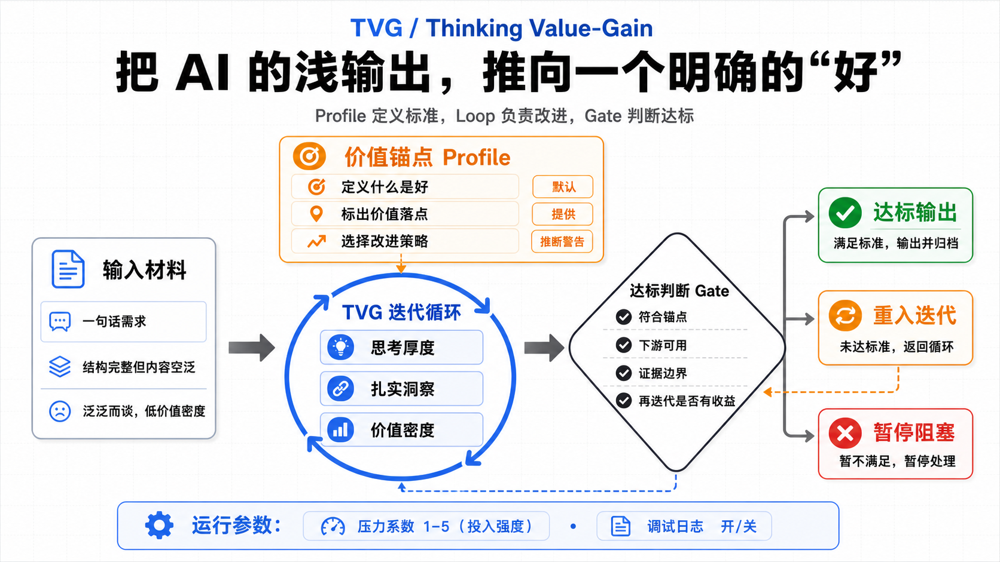

# TVG / Thinking Value-Gain

## 这是什么

TVG 是 `Thinking Value-Gain`，一套定向文本强化方法。它处理的是 AI 产物中很常见的一种失败：结构完整、表达流畅、格式规范，但真正要交给下游使用时，仍然浅、空、随机，缺少判断价值。

一句话说：

> TVG 让文本更接近某个“好”的标准。

项目地址：<https://github.com/rv198-star/Mindthus>

这个“好”不是随便的风格偏好，而是来自输出期望值、当前 value profile、事实边界、veto constraints 和 Gate 的可审查标准。默认情况下，它强化通用实用价值；当任务有明确领域、审美、品牌或写作目标时，profile 可以定义这次到底什么算好。

TVG 不鼓励把东西写长。它的核心不是“再扩写一轮”，而是识别一个已经成型的 bounded artifact，在不重开整个问题空间的前提下，判断哪里能增加真实可用性。

对 Mindthus 来说，TVG 很重要，因为方法论文档、计划、review、skill 和说明书都容易变成“看起来严谨”的空壳。TVG 负责在交付前问一句：这个东西对下游真的更有帮助了吗？

这里的“审计”只指 TVG loop 内部的退出判断：当前被 TVG 转换的 bounded artifact
能不能 freeze、return-remediate 或 blocked。它不是通用外部审计路线；代码审计、
release readiness、workflow 健康、事实核验、战略方向或需求边界，都要先按对象
路由到对应方法、测试、证据或人工评审。

## 解决什么问题

TVG 解决的是形式完成但实质不足。

典型场景包括：

- 文档有标题、有列表、有流程，但读者仍然不知道何时使用。
- 计划看起来完整，但没有取舍、风险、验收和失败路径。
- 方法论写得像定义，但缺少真实问题、误用边界和决策价值。
- AI 生成的方案很顺滑，却没有证据、例外、权衡或下游行动面。
- Skill 入口很规范，但 agent 读完仍然不知道应该如何落地。

TVG 的价值不是润色，而是让产物从“像完成品”走向“真的能被使用、审查、复用和交接”。扩提示词、改博客、增厚 PRD、强化技术方案、改发布说明，本质上都是同一件事：把文本按某个可审查的好标准做定向强化。

## 核心判断

TVG 的核心判断不是默认扩写，而是先判断当前模块离目标“好标准”差在哪里：思考厚度不够时加深，已经足够厚但松散时提炼，过厚低密度时收束增强，缺外部事实时停止或返回。

更准确地说：思考厚度是价值基底，有根洞察是核心产出，价值密度是交付质量。一个好的 TVG 输出应该让读者感觉“我没想到，但它说得通”，而不是只是更长、更稳或更完整。

它通常关注五类价值面：

- `judgment`：是否暴露了真正的判断依据，而不是只给结论。
- `evidence`：关键 claim 是否知道需要什么证据约束。
- `trade-off`：是否讲清代价、边界和适用条件。
- `handoff`：下游读者是否能直接行动，不需要重新发明上下文。
- `reuse`：这个模块是否能被迁移、审查或复用，而不是一次性回答。

如果再写一轮只是增加字数、重复观点或制造更漂亮的结构，就不该继续。如果再写一轮能让读者少走弯路、让 reviewer 更容易判断、让执行者更清楚下一步，才值得做。

## 怎么用

TVG 的轻量流程是：

1. 找到最小可冻结模块。不要一上来加深整个项目。
2. 说清它的下游用途：给谁读，用来做什么决定或行动。
3. 找出薄弱价值面：判断、证据、取舍、失败路径、复用还是交接。
4. 只在对应位置强化，不做无边界扩写。
5. 做一次 TVG-loop 退出审计：新增内容是否真的提高可用性，还是只是更长。

在更正式的场景里，可以使用 trace 脚本记录 value-gain 过程。但脚本只负责记录和校验形状，不能替你决定哪里值得加深。

一个好的 TVG 输出，应该让下游少问问题。读者不一定会觉得它“更华丽”，但会觉得它更可判断、更可执行、更能交接。

## 价值定义包

TVG 可以接受 `value_profile`，也就是价值定义包。它的作用不是让 TVG
更会堆内容，而是先说明“这个产物在本场景里什么叫好，什么叫坏”。

因此 profile 不是普通提示词模板，而是 TVG 的价值方向盘：它定义文本应该靠近哪一种好标准。

普通任务不需要用户额外提供价值定义。没有外部输入时，TVG 使用默认通用实用价值：

- 决策 / 行动杠杆更清楚。
- 证据诚实，不把假设写成事实。
- 下游更容易接手，不需要重新发明上下文。
- 降低误用、误判、假绿灯和过度自信风险。
- 保留可复用性，不为了一个样例过拟合。
- 更可执行，同时保持价值密度。

当任务有强审美、强品牌、强领域或强价值取向时，可以提供一套 `supplied`
profile。比如影视提示词、品牌文案、法律审查、教学材料、投资备忘录，都可能需要
不同的优劣定义。

Profile 对用户仍然是一个入口，但内部可以分层。

### TVG-Profile 是什么

如果把 TVG 理解成一个定向强化 loop，那么 TVG-Profile 就是这次 loop 的“好标准说明书”。
它不是为了把 prompt 写复杂，也不是给用户平白多加一套配置，而是先把这次到底要靠近哪种“好”说清楚。

默认 practical-value profile 已经够大多数任务使用。只有当你发现默认标准开始不够用，比如审美目标很强、
领域边界很强、下游检查单位很特殊，或者结果总靠运行时临场救场时，才值得把 Profile 显式写出来。

我们把这部分放进 TVG 详细介绍页，不是为了再多造一个概念，而是想把 TVG-Profile 讲成一个可用产品能力：
什么时候值得上、能细到什么程度、什么时候只用轻量层，什么时候该做完整高级包。

### Profile 的分层

Profile 最低可以只有一层，也可以做成完整高级包。更实用的理解是：

- `value_semantics`：必需的最小层。说明什么算高价值、什么算伪增益、优先级、
  证据基础和 profile-specific veto constraints。
- `realization_surface`：可选高级层。说明价值应该在哪些可检查单位里显现，例如
  分镜的 shot / panel、工程设计的 behavior path / interface contract、策略 memo
  的 decision fork / trigger。
- `gain_policy`：可选高级层。说明哪些深化动作更可能产生真实 value gain，哪些动作
  看似努力但只是低价值增厚。它不是评分器，也不是 RL reward model。
- `runtime_support`：高级包常见的第四层。说明有哪些脚本、模板、lint、资源包或
  记录器能提供确定性支撑，但它们不能替 TVG 做语义判断，也不能决定 exit。

允许一个 profile 只有 `value_semantics`。缺少 `realization_surface` 时，TVG 用模块类型
和下游用途判断价值显现面；缺少 `gain_policy` 时，TVG 回到默认增益动作：证据绑定、
替代方案和取舍、失败路径、claim ceiling、交接可用性和价值密度。前三层回答的是
“什么算好、好要落在哪里、通常怎么加深”；第四层回答的是“有哪些确定性支撑物能帮忙，
但它们不能替你下结论”。

构建 profile 时要区分两个测试：

- `single-pass profile power test`：固定 profile，只生成一次，不允许 TVG 多轮补救。
  它看的是 profile 本身有多少控制力。
- `loop-assisted production test`：允许 TVG 按 loop + Gate 多轮返修。它看的是最终能否
  产出可用结果，以及需要多少轮运行成本。

这两个 claim 不能混。如果单轮弱、但多轮后结果好，说明 TVG runtime 会补救，不等于
profile 已经成熟。未来 profile 构建要记录 `profile_control_power`、`required_runtime_rounds`
和 `residual_failure_modes`，避免把运行时救场误当成 profile 本身强。

TVG 给 Agent 使用时，默认输入不应该是一个让人填写的 Gate，而应该是
`expected_value`，也就是输出期望值：

- `target_artifact`：要改的片段、模块或产物。
- `artifact_job`：这个产物要帮谁完成什么评审、决策、实现、生成或交接。
- `useful_when`：输出达到什么状态才算真的有用。
- `hard_constraints`：不能违反什么用户约束、安全边界、veto constraints 或事实边界。
- `evidence_boundary`：哪些不能编，哪些只能标成假设或待确认。
- `output_bias`：最终表达要更浓缩、平衡，还是保留覆盖厚度。

Gate 是 Agent 内部从输出期望值编译出来的停机条件，不是给用户增加的配置负担。
这样兼容以前的 TVG 用法：以前其实也是先判断“这个产物要对下游产生什么价值”，只是没有
把这一步命名和记录得足够明确。

Gate 也不能只按影视提示词来理解。更通用的 Gate 应该同时能解释邵氏分镜和
RPD 文档增厚提价这两类不同任务：

- `hard veto gate`：证据诚实、claim ceiling、用户约束、安全边界、veto constraints
  不能被 profile 或更好的表达覆盖。
- `value-semantics fit gate`：产物是否体现当前 profile 或默认实用价值，而不是只变长。
- `downstream-use gate`：下游是否能行动、评审、决策、生成、交接，不需要补发明关键事实。
- `next-round positive-value gate`：下一轮是否有明确正价值假设；如果只是更顺、更厚、更像格式，
  就不应该继续 loop。

在邵氏分镜里，Gate 可以问：是否保留剧本事实、避开现代仙侠 / CG 奇观 / generic AI video
prompt inflation、是否有可评审 shot / panel 单位、是否足够支持下一步生图或分镜评审。

在 RPD 文档增厚提价里，Gate 要问的不是“文档有没有更厚”，而是：提价是否被连接到买方结果、
范围、证据或假设、替代方案、风险归属、实施路径和买方决策；是否避免编造 ROI、客户事实、
竞品事实、授权关系或付费意愿。这里的证据上限是：TVG 可以支持“这份文档更能支撑提价论证”，
不能证明客户会接受提价。

如果用户或 workflow 没有显式说明输出期望值，TVG 不能直接进入“加深”。默认必须先生成一个
`provisional-default` expected_value，然后由 Agent 内部编译出 `exit_gate`：

- 来自 TVG 固定底线：证据诚实、claim ceiling、用户约束、安全边界、veto constraints、
  不让下游补发明关键事实。
- 来自当前模块：它负责什么、冻结粒度是什么。
- 来自下游用途：谁要读、用来评审、决策、实现、生成还是交接。
- 来自 active profile：默认 practical-value profile，或用户提供的 supplied profile。
- 来自下一轮正价值条件：下一轮必须有明确 value-gain 假设，不能只是更顺、更厚、更像格式。

这个默认输出期望值和内部 Gate 都是 agentic runtime judgment，不是脚本评分。脚本最多记录和
校验 `expected_value` / `exit_gate` 形状，防止完全没说明输出期望值的运行看起来像完整运行；
脚本不能判断输出期望值正确、Gate 成功或是否可以 exit。

TVG 现在有三类运行时参考，用来观察 loop，不是替 Agent 做判断：

- `debug_log`：默认关闭。打开后记录每轮的 `candidate_pool`、Gate 检查、veto 检查、
  下一轮正价值假设和继续 / 停止理由，方便复盘。
- `value_gain_scoring_reference`：默认开启，是 always-on reference。它用 0-5 的参考刻度
  观察思考厚度、有根洞察和价值密度；scores help compare rounds, not compute decisions。
- `pressure`：投入强度，不是质量分。default pressure value 2 表示普通 TVG 投入；
  可设 1-5。5 是极限压力，通常意味着如果每轮仍有明确正价值假设，可以投入约 5-7 rounds。

简单说：pressure 决定“愿意多用力”，scoring 帮你看“这一轮是否还在涨”，Gate 仍然判断
“能不能停”。脚本只能记录和校验形状，不能判断 `pressure_correctness`、`score_based_exit`
或 `pressure_based_exit`。

`Value Profile Resolution` 的顺序是：

1. 用户明确提供时，使用 `mode: supplied`。
2. 项目有默认 profile 时，使用项目默认，除非用户覆盖。
3. 都没有时，使用 `default practical-value profile`。
4. Agent 只能从上下文推断时，必须标成 `inferred-with-warning`，并保留证据边界。
5. 如果 profile source conflicts with the artifact being improved，prefer independent profile sources over the artifact sample。

一句话：默认通用实用价值保证 TVG 不需要每次都先灌价值观；价值定义包让 TVG
在特定场景里不再把“提升价值”误做成普通加厚。

Profile 不能覆盖事实边界。profiles cannot override evidence honesty, claim ceilings, user constraints, safety boundaries, or veto constraints。

特别注意：不要从待改造样例反推风格规则。如果待升级对象本身可能就是错误、粗糙或跑偏的样例，它只能用来测试 profile，不能作为 profile 的来源。

当前随包提供五类 profile 资源：

- [`default-practical-value`](../../skills/tvg/resources/value-profiles/default-practical-value.md)：普通任务默认使用的通用实用价值锚点。
- [`plain-sharp-skill-intro`](../../skills/tvg/resources/value-profiles/plain-sharp-skill-intro.md)：轻量入口说明案例，展示不用脚本也能把“说清楚”约束得很细。
- [`shaw-brothers-wuxia-fantasy`](../../skills/tvg/resources/value-profiles/shaw-brothers-wuxia-fantasy.md)：邵氏清水湾棚拍时代武侠 / 神怪影视提示词示范 profile。
- [`king-hu-wuxia-cinema`](../../skills/tvg/resources/value-profiles/king-hu-wuxia-cinema.md)：胡金铨武侠电影影视提示词示范 profile。
- [`cinematic-colossal-realism`](../../skills/tvg/resources/value-profiles/cinematic-colossal-realism/profile.md)：把外部 cinematic skill 当行为样本拆成四层高级包的示范案例。

如果要写、改或评审自己的 TVG-Profile，先看
[`TVG Value Profile Construction Guide`](../../skills/tvg/resources/value-profiles/profile-construction.md)。
它比本文更偏操作：最小 profile 结构、`value_semantics / realization_surface / gain_policy`
三层怎么取舍、single-pass profile power test 和 loop-assisted production test 如何分开记录，
都放在那里。

其中公开案例重点看三组：

- [轻量 Profile 案例：`plain-sharp-skill-intro`](tvg-profile-cases/plain-sharp-skill-intro.md)
- [风格型影视 Profile 案例：`shaw-brothers-wuxia-fantasy` + `king-hu-wuxia-cinema`](tvg-profile-cases/film-style-profiles.md)
- [四层高级包案例：`cinematic-colossal-realism`](tvg-profile-cases/cinematic-colossal-realism.md)

前两个影视 profile 是示范 profile，不是电影史分类结论，也不是对图像模型的稳定风格保证。它们展示的是
三层 profile 怎么发挥作用：`value_semantics` 说明什么算好，`realization_surface` 说明价值要落在
shot / panel / source-attribution 这类可检查单位上，`gain_policy` 说明 TVG 扩写剧本时应该优先
增加哪些镜头行为、空间关系、节奏结构和自审问题。

`cinematic-colossal-realism` 进一步展示四层完整包怎么工作：前三层定义“什么算好”，第四层用
runtime_support 提供脚本、资源和 lint，但仍然保留“脚本不能决定美学成功、profile 成熟度或 TVG 退出”
这条边界。

示范 profile 的证据上限要说清楚：prompt 或图像 smoke 通过，只能支持“这个 profile 对这类输出有
可用约束力”；不能证明某个导演风格已经被完整定义，也不能证明任何图像模型都会稳定生成对应风格。

### 案例索引

如果你想把 TVG-Profile 当成一个高级用法来学，最顺的阅读顺序通常是：

1. [轻量 Profile：把技能介绍写得更短、更准、更像入口](tvg-profile-cases/plain-sharp-skill-intro.md)
2. [风格型 Profile：不靠脚本，也能把“导演感”拆成可审查单位](tvg-profile-cases/film-style-profiles.md)
3. [四层高级包：把外部 skill 迁成 TVG-Profile，而不是复制它](tvg-profile-cases/cinematic-colossal-realism.md)

## 输出档位

TVG 可以接受输出档位，但档位只影响交付表达，不改变内部主线。

- `洞察密度优先`：更快进入关键判断，表达更锋利、更收束。
- `平衡档`：默认形态，不主动扩厚，也不过早压缩。
- `覆盖厚度优先`：允许更多背景、例子、推理路径和边界说明，适合教程、交接和复杂设计。

档位不能降低价值标准。洞察密度优先不能跳过必要的思考厚度；覆盖厚度优先也不能允许低价值扩写。

更准确地说，输出档位应该放在出口做分级提炼。先过厚度闸门：约束、替代方案、失败路径、证据边界和必要待确认项足够之后，才按档位决定最终表达是更锋利、更平衡，还是保留更多覆盖厚度。

洞察密度优先要保留有校准的判断张力。它应该用更少文字打出更清楚的边界，不是把观点压成保守免责声明。校准提醒只负责标出依据、范围或待确认风险，不能把有根洞察磨平成普通安全话术。

平衡档要保持比例感。它应该给出可执行的分流、边界或规则，但不要为了显得可执行而制造评分系统；如果不可逆风险、回退条件或复审节奏会改变路由，不可逆风险和最低复审节奏要进入规则正文，不能只丢到待确认项里。没有领域周期时给一个可校准的临时周期，不要只写定期复审。

覆盖厚度优先要保留评审结构。用于评审、交接、设计说明或复杂决策时，厚度不只是背景和例子，还应该保留决策问题、决策标准、成败条件、替代方案、替代工作流、采纳风险、失败路径、证据和假设边界、待确认项。不能为了显得更有价值密度，把这些对下游有用的结构过早压扁。

## 具体案例

### 案例 A：README 结构完整但没人想用

一个 README 可能有“是什么、能做什么、如何安装、如何验证”，结构完全合格，但读者看完仍然不知道为什么这个项目值得试。TVG 不会建议单纯扩写每个标题，而是先找薄弱价值面：缺少真实失败场景、缺少方法入口和使用动机。

有效加深可能是增加“AI workflow 常见失败”的描述、把每个方法写成“解决什么问题”，并补链接到详细方法页。无效加深则是继续堆抽象定义。

### 案例 B：计划文档看起来完整但不能交接

一个实现计划列了 20 个任务，却没有说明当前基线、验收标准、失败路径和谁有权决定停止。它看起来很勤奋，但下游接手仍要重新判断。

TVG 会把加深点放在 handoff value 上：补验收条件、风险、证据面和决策边界，而不是把每个任务再写长一倍。

## 常见误用

第一种误用，是把深度等同于篇幅。长文档也可以很浅，短文档也可以很有判断。

另一种误用，是把“耳目一新”做成无根幻想。TVG 允许有张力的外推，但外推必须能回扣到真实矛盾、趋势、约束、需求、反例或结构推理。没有锚点的新奇不是洞察。

第二种误用，是把 TVG 用成润色器。表达清楚当然重要，但 TVG 关心的是价值密度，不是句子漂亮。

第三种误用，是在缺事实时继续加深。缺证据、缺领域输入、缺运行结果时，应该补输入，而不是让 agent 用更自信的语气填空。

第四种误用，是重开整个问题空间。TVG 只处理边界清楚的模块。如果目标、对象、读者都不清楚，应该先回到 `3L5S`。

## 边界

TVG 不负责战略方向，不替代 `SELA`。它也不负责定义混乱问题，不替代 `3L5S`。

当缺的是事实、领域判断、用户输入、运行时证明或 stakeholder 决策时，TVG 应该停止。继续写只会把不确定性包装成流畅文本。

TVG 也不应该成为反螺旋的借口。如果同一段内容已经被第三次强化，或者每轮只是更长但没有新的约束，应触发 `Anti-Spiral`。

## 与其他方法的关系

- `3L5S` 可以产出 TVG 的输入模块，例如问题定义、计划或任务拆解。
- `WAE` 判断某个薄弱点是流程问题、判断问题还是证据问题。
- `tplan` 可以承载 TVG trace、审计记录和停止条件。
- `Anti-Spiral` 防止 TVG 从定向价值强化退化成局部打磨循环。

## 导航

- 返回 [README](../../README.md)
- 查看 [TVG skill](../../skills/tvg/SKILL.md)
- 查看 [TVG-Profile 轻量案例](tvg-profile-cases/plain-sharp-skill-intro.md)
- 查看 [TVG-Profile 风格型案例](tvg-profile-cases/film-style-profiles.md)
- 查看 [TVG-Profile 四层高级案例](tvg-profile-cases/cinematic-colossal-realism.md)
