# TPlan 实际执行与成本树

> 生命周期追踪从 Mission 初始化开始；各类成本仍只包含宿主实际上报的 span。

```mermaid
flowchart TB
  M["周末补货与仓配可执行性决策<br/>Mission · 成功 · 实际历时 4m59s<br/>LLM调用累计 1m20s（调用端实测） · 脚本累计 2m36s（宿主实测）<br/>工具累计 35s（宿主实测） · 等待累计 25s（宿主实测）<br/>未被精确记录 2.9s · Token ≈入 2.8k / 出 540<br/>覆盖 exact · standard"]
  N1["[Task] 建立库存与销售基线 · T1<br/>✓ 成功 · #1 · 子树汇总<br/>实际历时 51s · 未被精确记录 492ms<br/>LLM调用累计 未采集 · 脚本累计 50s（宿主实测）<br/>工具累计 未采集 · 等待累计 未采集 · Token 未采集<br/>结果：经营数据基线通过验收"]
  N2["[SubTask] 准备 SKU 经营快照 · S1.1<br/>✓ 成功 · #2 · 子树汇总<br/>实际历时 51s · 未被精确记录 427ms<br/>LLM调用累计 未采集 · 脚本累计 50s（宿主实测）<br/>工具累计 未采集 · 等待累计 未采集 · Token 未采集<br/>结果：SKU 快照、质量检查和覆盖基线均已完成"]
  N3["[Step] 生成 SKU 销售库存快照 · P1.1.1<br/>✓ 成功 · #3 · 直接成本<br/>实际历时 15s · 未被精确记录 109ms<br/>LLM调用累计 未采集 · 脚本累计 15s（宿主实测）<br/>工具累计 未采集 · 等待累计 未采集 · Token 未采集<br/>结果：六个 SKU 的销售库存快照已生成"]
  N4["[Step] 核对字段与库存勾稽 · P1.1.2<br/>✓ 成功 · #4 · 直接成本<br/>实际历时 15s · 未被精确记录 90ms<br/>LLM调用累计 未采集 · 脚本累计 15s（宿主实测）<br/>工具累计 未采集 · 等待累计 未采集 · Token 未采集<br/>结果：六行快照通过字段和非负值检查"]
  N5["[Step] 计算库存覆盖与缺货窗口 · P1.1.3<br/>✓ 成功 · #5 · 直接成本<br/>实际历时 20s · 未被精确记录 97ms<br/>LLM调用累计 未采集 · 脚本累计 20s（宿主实测）<br/>工具累计 未采集 · 等待累计 未采集 · Token 未采集<br/>结果：库存覆盖天数和风险窗口已形成"]
  N6["[Task] 形成补货候选与商业选择 · T2<br/>✓ 成功 · #6 · 子树汇总<br/>实际历时 1m46s · 未被精确记录 646ms<br/>LLM调用累计 1m00s（调用端实测） · 脚本累计 45s（宿主实测）<br/>工具累计 未采集 · 等待累计 未采集 · Token ≈入 1.7k / 出 320<br/>结果：补货候选与商业选择通过验收"]
  N7["[SubTask] 评估 SKU 断货风险 · S2.1<br/>✓ 成功 · #7 · 子树汇总<br/>实际历时 1m00s · 未被精确记录 267ms<br/>LLM调用累计 35s（调用端实测） · 脚本累计 25s（宿主实测）<br/>工具累计 未采集 · 等待累计 未采集 · Token ≈入 980 / 出 180<br/>结果：断货风险和候选数量已形成"]
  N8["[Step] 解释高风险 SKU 与经营影响 · P2.1.1<br/>✓ 成功 · #8 · 直接成本<br/>实际历时 35s · 未被精确记录 51ms<br/>LLM调用累计 35s（调用端实测） · 脚本累计 未采集<br/>工具累计 未采集 · 等待累计 未采集 · Token ≈入 980 / 出 180<br/>结果：高风险 SKU 与经营影响解释已形成"]
  N9["[Step] 计算首轮候选补货量 · P2.1.2<br/>✓ 成功 · #9 · 直接成本<br/>实际历时 25s · 未被精确记录 112ms<br/>LLM调用累计 未采集 · 脚本累计 25s（宿主实测）<br/>工具累计 未采集 · 等待累计 未采集 · Token 未采集<br/>结果：首轮候选补货量已生成"]
  N10["[SubTask] 选择资金约束内方案 · S2.2<br/>✓ 成功 · #10 · 子树汇总<br/>实际历时 45s · 未被精确记录 277ms<br/>LLM调用累计 25s（调用端实测） · 脚本累计 20s（宿主实测）<br/>工具累计 未采集 · 等待累计 未采集 · Token ≈入 760 / 出 140<br/>结果：资金约束内的补货方案已选择"]
  N11["[Step] 比较保守、平衡与进取方案 · P2.2.1<br/>✓ 成功 · #11 · 直接成本<br/>实际历时 25s · 未被精确记录 73ms<br/>LLM调用累计 25s（调用端实测） · 脚本累计 未采集<br/>工具累计 未采集 · 等待累计 未采集 · Token ≈入 760 / 出 140<br/>结果：保守、平衡和进取方案已完成比较"]
  N12["[Step] 校验采购预算与库存上限 · P2.2.2<br/>✓ 成功 · #12 · 直接成本<br/>实际历时 20s · 未被精确记录 91ms<br/>LLM调用累计 未采集 · 脚本累计 20s（宿主实测）<br/>工具累计 未采集 · 等待累计 未采集 · Token 未采集<br/>结果：平衡方案通过预算与仓容约束"]
  N13["[Task] 确认供应商与仓配可执行性 · T3<br/>✓ 成功 · #13 · 子树汇总<br/>实际历时 1m26s · 未被精确记录 938ms<br/>LLM调用累计 未采集 · 脚本累计 25s（宿主实测）<br/>工具累计 35s（宿主实测） · 等待累计 25s（宿主实测） · Token 未采集<br/>结果：供应商与仓配可执行性通过验收"]
  N14["[SubTask] 获取供应商承诺 · S3.1<br/>✓ 成功 · #14 · 子树汇总<br/>实际历时 45s · 未被精确记录 353ms<br/>LLM调用累计 未采集 · 脚本累计 未采集<br/>工具累计 20s（宿主实测） · 等待累计 25s（宿主实测） · Token 未采集<br/>结果：报价、交期和库存锁定均已确认"]
  N15["[Step] 拉取供应商报价与交期 · P3.1.1<br/>✓ 成功 · #15 · 直接成本<br/>实际历时 20s · 未被精确记录 106ms<br/>LLM调用累计 未采集 · 脚本累计 未采集<br/>工具累计 20s（宿主实测） · 等待累计 未采集 · Token 未采集<br/>结果：供应商报价与交期已返回"]
  N16["[Step] 等待供应商锁定库存 · P3.1.2<br/>✓ 成功 · #16 · 直接成本<br/>实际历时 25s · 未被精确记录 99ms<br/>LLM调用累计 未采集 · 脚本累计 未采集<br/>工具累计 未采集 · 等待累计 25s（宿主实测） · Token 未采集<br/>结果：供应商已锁定关键 SKU 库存"]
  N17["[SubTask] 校验供应条款并预约仓容 · S3.2<br/>✓ 成功 · #17 · 子树汇总<br/>实际历时 41s · 未被精确记录 461ms<br/>LLM调用累计 未采集 · 脚本累计 25s（宿主实测）<br/>工具累计 15s（宿主实测） · 等待累计 未采集 · Token 未采集<br/>结果：供应条款重试通过且仓容预约完成"]
  N18["[Step] 校验供应商交期条款并重试 · P3.2.1<br/>✓ 成功 · #18 · 直接成本 · 执行次数 2 · 错误 1<br/>实际历时 25s · 未被精确记录 224ms<br/>LLM调用累计 未采集 · 脚本累计 25s（宿主实测）<br/>工具累计 未采集 · 等待累计 未采集 · Token 未采集<br/>结果：第一次缺少分批承诺，修正响应后重试通过"]
  N19["[Step] 预约到货仓容与卸货时段 · P3.2.2<br/>✓ 成功 · #19 · 直接成本<br/>实际历时 15s · 未被精确记录 120ms<br/>LLM调用累计 未采集 · 脚本累计 未采集<br/>工具累计 15s（宿主实测） · 等待累计 未采集 · Token 未采集<br/>结果：仓容和卸货时段预约成功"]
  N20["[Task] 交付补货决策与验收包 · T4<br/>✓ 成功 · #20 · 子树汇总<br/>实际历时 56s · 未被精确记录 524ms<br/>LLM调用累计 20s（调用端实测） · 脚本累计 35s（宿主实测）<br/>工具累计 未采集 · 等待累计 未采集 · Token ≈入 1.1k / 出 220<br/>结果：补货决策与验收包交付完成"]
  N21["[SubTask] 生成并核验补货简报 · S4.1<br/>✓ 成功 · #21 · 子树汇总<br/>实际历时 56s · 未被精确记录 453ms<br/>LLM调用累计 20s（调用端实测） · 脚本累计 35s（宿主实测）<br/>工具累计 未采集 · 等待累计 未采集 · Token ≈入 1.1k / 出 220<br/>结果：补货简报与验收结果均已完成"]
  N22["[Step] 组织补货决策叙事 · P4.1.1<br/>✓ 成功 · #22 · 直接成本<br/>实际历时 20s · 未被精确记录 77ms<br/>LLM调用累计 20s（调用端实测） · 脚本累计 未采集<br/>工具累计 未采集 · 等待累计 未采集 · Token ≈入 1.1k / 出 220<br/>结果：经营决策简报提纲已形成"]
  N23["[Step] 生成周末补货执行简报 · P4.1.2<br/>✓ 成功 · #23 · 直接成本<br/>实际历时 20s · 未被精确记录 112ms<br/>LLM调用累计 未采集 · 脚本累计 20s（宿主实测）<br/>工具累计 未采集 · 等待累计 未采集 · Token 未采集<br/>结果：周末补货执行简报已生成"]
  N24["[Step] 核对验收证据与遥测完整性 · P4.1.3<br/>✓ 成功 · #24 · 直接成本<br/>实际历时 15s · 未被精确记录 119ms<br/>LLM调用累计 未采集 · 脚本累计 15s（宿主实测）<br/>工具累计 未采集 · 等待累计 未采集 · Token 未采集<br/>结果：A1 至 A4 业务验收检查全部通过"]
  M --> N1
  N1 --> N2
  N2 --> N3
  N2 --> N4
  N2 --> N5
  M --> N6
  N6 --> N7
  N7 --> N8
  N7 --> N9
  N6 --> N10
  N10 --> N11
  N10 --> N12
  M --> N13
  N13 --> N14
  N14 --> N15
  N14 --> N16
  N13 --> N17
  N17 --> N18
  N17 --> N19
  M --> N20
  N20 --> N21
  N21 --> N22
  N21 --> N23
  N21 --> N24
  classDef mission fill:#172554,color:#ffffff,stroke:#1d4ed8,stroke-width:2px;
  classDef active fill:#dbeafe,color:#172554,stroke:#2563eb,stroke-width:2px;
  classDef completed fill:#dcfce7,color:#14532d,stroke:#16a34a;
  classDef blocked fill:#fee2e2,color:#7f1d1d,stroke:#dc2626,stroke-width:2px;
  classDef paused fill:#fef3c7,color:#78350f,stroke:#d97706;
  classDef pending fill:#f8fafc,color:#475569,stroke:#94a3b8,stroke-dasharray:4 3;
  classDef closed fill:#f1f5f9,color:#334155,stroke:#64748b;
  class M mission;
  class N1,N2,N3,N4,N5,N6,N7,N8,N9,N10,N11,N12,N13,N14,N15,N16,N17,N18,N19,N20,N21,N22,N23,N24 completed;
```

视图：`standard`；真实节点：24/24。

口径：实际历时按开始到结束的自然经过时间计算；LLM 调用、脚本、工具和等待显示的是各自累计资源时间，嵌套或并行时不可直接相加。调用端实测覆盖完整模型请求，可能包含排队、网络和流式传输，不等于平台内部纯推理时间。未被精确记录 = 实际历时减去已完成且时间来源精确的区间并集；它不自动属于 LLM、脚本或其他类别。已缓存输入包含在输入 Token 中，不会重复累计。
