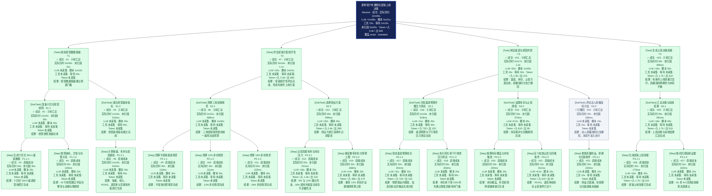

# TPlan 实际执行与成本树

> 生命周期追踪从 Mission 初始化开始；各类成本仍只包含宿主实际上报的 span。

```mermaid
flowchart TB
  M["夏季轻户外通勤包促销上线决策<br/>Mission · 成功 · 实际历时 12m06s<br/>LLM ≈1m08s · 脚本 5m31s<br/>工具 15s · 等待 1m15s<br/>未归因 5m05s · Token ≈入 5.4k / 出 905<br/>覆盖 exact · standard"]
  N1["[Task] 校验经营数据基础 · T1<br/>✓ 成功 · #1 · 子树汇总<br/>实际历时 2m26s · 未归因 31s<br/>LLM 未采集 · 脚本 1m10s<br/>工具 未采集 · 等待 45s · Token 未采集<br/>结果：经营数据基础通过质量门槛"]
  N2["[SubTask] 准备十四天经营快照 · S1.1<br/>✓ 成功 · #2 · 子树汇总<br/>实际历时 1m15s · 未归因 30s<br/>LLM 未采集 · 脚本 45s<br/>工具 未采集 · 等待 未采集 · Token 未采集<br/>结果：经营快照准备完成"]
  N3["[Step] 生成十四天 SKU×渠道数据 · P1.1.1<br/>✓ 成功 · #3 · 直接成本<br/>实际历时 55s · 未归因 30s<br/>LLM 未采集 · 脚本 25s<br/>工具 未采集 · 等待 未采集 · Token 未采集<br/>结果：十四天 SKU×渠道经营快照已生成"]
  N4["[Step] 检查缺失、异常与勾稽关系 · P1.1.2<br/>✓ 成功 · #4 · 直接成本<br/>实际历时 20s · 未归因 125ms<br/>LLM 未采集 · 脚本 20s<br/>工具 未采集 · 等待 未采集 · Token 未采集<br/>结果：42 行快照通过字段完整性与金额勾稽检查"]
  N5["[SubTask] 建立经营基线指标 · S1.2<br/>✓ 成功 · #5 · 子树汇总<br/>实际历时 1m10s · 未归因 314ms<br/>LLM 未采集 · 脚本 25s<br/>工具 未采集 · 等待 45s · Token 未采集<br/>结果：经营基线指标建立完成"]
  N6["[Step] 计算销量、毛利与投放基线 · P1.2.1<br/>✓ 成功 · #6 · 直接成本<br/>实际历时 1m10s · 未归因 242ms<br/>LLM 未采集 · 脚本 25s<br/>工具 未采集 · 等待 45s · Token 未采集<br/>结果：销量、收入、ROAS、退货率与贡献毛利基线已生成"]
  N7["[Task] 评估促销方案经济性 · T2<br/>✓ 成功 · #7 · 子树汇总<br/>实际历时 2m16s · 未归因 1.1s<br/>LLM ≈32s · 脚本 2m15s<br/>工具 未采集 · 等待 未采集 · Token ≈入 2.4k / 出 380<br/>结果：促销经济性评估完成，形成有条件上线方案"]
  N8["[SubTask] 测算三档促销情景 · S2.1<br/>✓ 成功 · #8 · 子树汇总<br/>实际历时 1m31s · 未归因 468ms<br/>LLM 未采集 · 脚本 1m30s<br/>工具 未采集 · 等待 未采集 · Token 未采集<br/>结果：三档促销情景使用统一基线完成测算"]
  N9["[Step] 测算不促销基准情景 · P2.1.1<br/>✓ 成功 · #9 · 直接成本<br/>实际历时 30s · 未归因 110ms<br/>LLM 未采集 · 脚本 30s<br/>工具 未采集 · 等待 未采集 · Token 未采集<br/>结果：不促销对照情景完成"]
  N10["[Step] 测算 12% 折扣情景 · P2.1.2<br/>✓ 成功 · #10 · 直接成本<br/>实际历时 30s · 未归因 111ms<br/>LLM 未采集 · 脚本 30s<br/>工具 未采集 · 等待 未采集 · Token 未采集<br/>结果：12% 折扣情景完成"]
  N11["[Step] 测算 18% 折扣情景 · P2.1.3<br/>✓ 成功 · #11 · 直接成本<br/>实际历时 30s · 未归因 102ms<br/>LLM 未采集 · 脚本 30s<br/>工具 未采集 · 等待 未采集 · Token 未采集<br/>结果：18% 折扣情景完成"]
  N12["[SubTask] 选择商业方案 · S2.2<br/>✓ 成功 · #12 · 子树汇总<br/>实际历时 46s · 未归因 499ms<br/>LLM ≈32s · 脚本 45s<br/>工具 未采集 · 等待 未采集 · Token ≈入 2.4k / 出 380<br/>结果：商业方案已选择并记录取舍"]
  N13["[Step] 比较贡献毛利与库存压力 · P2.2.1<br/>✓ 成功 · #13 · 直接成本<br/>实际历时 25s · 未归因 221ms<br/>LLM ≈18s · 脚本 25s<br/>工具 未采集 · 等待 未采集 · Token ≈入 1.4k / 出 210<br/>结果：0% 与 12% 通过约束，18% 因毛利和安全库存不足被否决"]
  N14["[Step] 确定推荐折扣与预算上限 · P2.2.2<br/>✓ 成功 · #14 · 直接成本<br/>实际历时 20s · 未归因 168ms<br/>LLM ≈14s · 脚本 20s<br/>工具 未采集 · 等待 未采集 · Token ≈入 980 / 出 170<br/>结果：推荐 12% 折扣并设置媒体预算上限"]
  N15["[Task] 制定渠道与经营风控 · T3<br/>✓ 成功 · #15 · 子树汇总<br/>实际历时 2m17s · 未归因 1.3s<br/>LLM ≈20s · 脚本 1m30s<br/>工具 15s · 等待 30s · Token ≈入 1.3k / 出 215<br/>结果：渠道、库存、止损方案完成，直播加码分支已撤回"]
  N16["[SubTask] 分配渠道预算并做压力测试 · S3.1<br/>✓ 成功 · #16 · 子树汇总<br/>实际历时 1m16s · 未归因 518ms<br/>LLM ≈11s · 脚本 45s<br/>工具 未采集 · 等待 30s · Token ≈入 720 / 出 120<br/>结果：渠道预算与下行情景压力测试完成"]
  N17["[Step] 形成渠道预算组合 · P3.1.1<br/>✓ 成功 · #17 · 直接成本<br/>实际历时 20s · 未归因 201ms<br/>LLM ≈11s · 脚本 20s<br/>工具 未采集 · 等待 未采集 · Token ≈入 720 / 出 120<br/>结果：预算按站内搜索、信息流和会员触达完成分配"]
  N18["[Step] 执行转化率下行情景压力测试 · P3.1.2<br/>✓ 成功 · #18 · 直接成本<br/>实际历时 55s · 未归因 203ms<br/>LLM 未采集 · 脚本 25s<br/>工具 未采集 · 等待 30s · Token 未采集<br/>结果：转化率下滑 15% 时仍通过最低贡献毛利门槛"]
  N19["[SubTask] 设置库存与止损阈值 · S3.2<br/>✓ 成功 · #19 · 子树汇总<br/>实际历时 35s · 未归因 374ms<br/>LLM ≈9.0s · 脚本 35s<br/>工具 未采集 · 等待 未采集 · Token ≈入 610 / 出 95<br/>结果：库存保护与回撤规则完成"]
  N20["[Step] 核算库存覆盖与补货触发 · P3.2.1<br/>✓ 成功 · #20 · 直接成本<br/>实际历时 20s · 未归因 105ms<br/>LLM 未采集 · 脚本 20s<br/>工具 未采集 · 等待 未采集 · Token 未采集<br/>结果：库存覆盖、补货和暂停促销阈值已生成"]
  N21["[Step] 定义投放止损与回撤条件 · P3.2.2<br/>✓ 成功 · #21 · 直接成本<br/>实际历时 15s · 未归因 161ms<br/>LLM ≈9.0s · 脚本 15s<br/>工具 未采集 · 等待 未采集 · Token ≈入 610 / 出 95<br/>结果：ROAS、退货率和库存止损条件已定义"]
  N22["[SubTask] 评估达人直播加码分支 · S3.3<br/>× 已撤回 · #22 · 子树汇总<br/>实际历时 25s · 未归因 296ms<br/>LLM 未采集 · 脚本 10s<br/>工具 15s · 等待 未采集 · Token 未采集<br/>结果：达人直播加码分支撤回，本轮不进入执行"]
  N23["[Step] 检查直播样品、排期与归因条件 · P3.3.1<br/>✓ 成功 · #23 · 直接成本<br/>实际历时 25s · 未归因 220ms<br/>LLM 未采集 · 脚本 10s<br/>工具 15s · 等待 未采集 · Token 未采集<br/>结果：样品已就绪，但排期与归因链路未就绪"]
  N24["[Task] 生成上线决策简报 · T4<br/>✓ 成功 · #24 · 子树汇总<br/>实际历时 36s · 未归因 466ms<br/>LLM ≈16s · 脚本 35s<br/>工具 未采集 · 等待 未采集 · Token ≈入 1.7k / 出 310<br/>结果：有条件上线简报已交付，直播加码明确列为本轮不做"]
  N25["[SubTask] 汇总决策与验收结果 · S4.1<br/>✓ 成功 · #25 · 子树汇总<br/>实际历时 35s · 未归因 391ms<br/>LLM ≈16s · 脚本 35s<br/>工具 未采集 · 等待 未采集 · Token ≈入 1.7k / 出 310<br/>结果：上线决策与验收结果汇总完成"]
  N26["[Step] 生成促销上线简报 · P4.1.1<br/>✓ 成功 · #26 · 直接成本<br/>实际历时 20s · 未归因 173ms<br/>LLM ≈16s · 脚本 20s<br/>工具 未采集 · 等待 未采集 · Token ≈入 1.7k / 出 310<br/>结果：促销上线简报已生成"]
  N27["[Step] 核对四项验收证据 · P4.1.2<br/>✓ 成功 · #27 · 直接成本<br/>实际历时 15s · 未归因 102ms<br/>LLM 未采集 · 脚本 15s<br/>工具 未采集 · 等待 未采集 · Token 未采集<br/>结果：A1 至 A4 四项验收检查全部通过"]
  M --> N1
  N1 --> N2
  N2 --> N3
  N2 --> N4
  N1 --> N5
  N5 --> N6
  M --> N7
  N7 --> N8
  N8 --> N9
  N8 --> N10
  N8 --> N11
  N7 --> N12
  N12 --> N13
  N12 --> N14
  M --> N15
  N15 --> N16
  N16 --> N17
  N16 --> N18
  N15 --> N19
  N19 --> N20
  N19 --> N21
  N15 --> N22
  N22 --> N23
  M --> N24
  N24 --> N25
  N25 --> N26
  N25 --> N27
  classDef mission fill:#172554,color:#ffffff,stroke:#1d4ed8,stroke-width:2px;
  classDef active fill:#dbeafe,color:#172554,stroke:#2563eb,stroke-width:2px;
  classDef completed fill:#dcfce7,color:#14532d,stroke:#16a34a;
  classDef blocked fill:#fee2e2,color:#7f1d1d,stroke:#dc2626,stroke-width:2px;
  classDef paused fill:#fef3c7,color:#78350f,stroke:#d97706;
  classDef pending fill:#f8fafc,color:#475569,stroke:#94a3b8,stroke-dasharray:4 3;
  classDef closed fill:#f1f5f9,color:#334155,stroke:#64748b;
  class M mission;
  class N1,N2,N3,N4,N5,N6,N7,N8,N9,N10,N11,N12,N13,N14,N15,N16,N17,N18,N19,N20,N21,N23,N24,N25,N26,N27 completed;
  class N22 closed;
```

视图：`standard`；真实节点：27/27。

口径：实际历时按开始到结束的自然经过时间计算；LLM、脚本、工具和等待是资源占用时间，嵌套或并行时不可直接相加。已缓存输入包含在输入 Token 中，不会重复累计。
