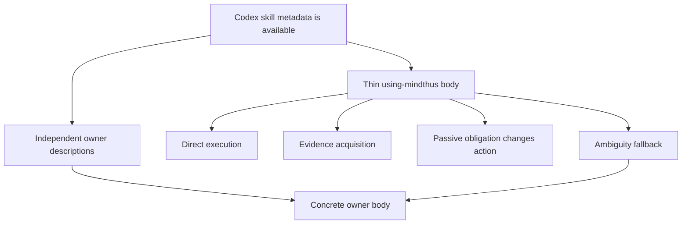

# Mindthus 2.0 Successor — Codex-Native Thin Router Design

Date: 2026-07-19

Status: `design-only / successor candidate / not Beta.3`

Base: `f131fd8874550b9b7c8c24e1acee2e5cbecddd8a`

Branch: `codex/2.0-next-native-thin-router`

Surface: Codex only

## Decision

The successor should replace Beta.1's two active entry layers—SessionStart Passive
Kernel plus arbitration-only `using-mindthus`—with one natively discoverable, very small
`using-mindthus` skill.

This means:

- `using-mindthus` remains available for every conversation through its own skill
  description;
- its body carries only the intervention boundary, four passive cognitive obligations,
  direct-owner rule, and genuine ambiguity fallback;
- concrete owner skills continue to match independently from their own descriptions;
- no SessionStart hook, separate guard skill, method map, model-name route, or routing
  policy in the plugin default prompt is allowed; and
- the current 1.4.6 owner bodies remain unchanged in the first implementation slice.

This design is deliberately falsifiable. Native discovery is the candidate carrier, not
an assumed platform guarantee. If an isolated Codex qualification cannot show that the
thin entry activates on passive-positive and ordinary turns without a Hook, this route
stops. It must not be rescued by adding another carrier or protocol layer.

## What this solves for the user

The intended experience is:

- simple work starts immediately;
- missing facts cause inspection, not methodology;
- a clearly matching owner is reached in the same turn without a router conversation;
- Frame, Whole, Decision Context, and Anti-Spiral can still intervene even when no owner
  skill would otherwise wake; and
- ambiguous ownership creates at most one real clarification, not a tour through all
  Mindthus methods.

The target is not to make Mindthus invisible at any cost. It is to make its fixed cost
small enough that passive protection remains worthwhile on a high-capability Codex host.

## Evidence and premise boundary

### Beta.1 and Beta.2

Beta.1 established an isolated package shape at `f131fd88`, but its active entry path is
split across:

| Active text | Words | Bytes |
| --- | ---: | ---: |
| SessionStart Passive Kernel | 326 | 2,344 |
| Arbitration-only `using-mindthus` | 359 | 2,424 |
| Combined Beta.1 entry path | 685 | 4,768 |
| Stable 1.4.6 `using-mindthus` | 903 | 7,193 |

These are repository word and byte counts, not measured runtime tokens or latency.

Beta.2 ended `STOP_UNPROVEN / SUPERSEDED`. It did not produce an eligible formal arm and
therefore did not prove either that the Thin-Kernel direction works or that it fails.
The successor may reuse individual isolation, scoring, telemetry, or case fixtures, but
must not inherit the Beta.2 runner and protocol stack wholesale.

### `superpowers-gpt-5.6`

The primary external design reference is
[`eagleagentic/superpowers-gpt-5.6`](https://github.com/eagleagentic/superpowers-gpt-5.6)
at reviewed commit `aa97377`.

Its useful structural evidence is:

- it retains a mandatory-by-description `using-superpowers` entry rather than deleting
  the entry;
- the current entry is 179 words and delegates specialist activation to each skill's
  own description;
- an earlier universal plan/log/reconciliation chain was removed in
  [`ec6f107`](https://github.com/eagleagentic/superpowers-gpt-5.6/commit/ec6f10787cba4d06a82371c980d9b4bd7233f848);
- an overly permissive direct route then lost newcomer safeguards, so a small mandatory
  core was restored in
  [`2d6b60b`](https://github.com/eagleagentic/superpowers-gpt-5.6/commit/2d6b60bb93452d7e34aa6125087046cc1d7e3e55);
- later wording limited escalation to uncertainty that can change behavior, scope,
  authority, or named risk; and
- Codex-native delegation replaced prompt-level orchestration skills.

The repository reports an 85.5% runtime-skill word reduction, but publishes static
budgets and practical observations rather than a blinded same-task quality/cost proof.
It is design evidence, not Mindthus outcome evidence. It also has no recognized license
at review time, so this project may borrow the architectural lesson but must not copy its
text or code.

### Premise correction

The controlling distinction is host capability, not the string `GPT-5.6` or `Sol`.
Mindthus must not route by model name. The candidate is valid only on a Codex surface
that exposes skill metadata, can semantically select skills, and yields enough evidence
to qualify activation and owner loading.

## Problem definition

The successor must resolve this tension:

1. Removing `using-mindthus` entirely lowers fixed context cost but removes the only
   general passive activation opportunity for cross-cutting primitives.
2. Keeping Stable 1.4.6's 903-word router preserves recall but duplicates method
   descriptions and adds a large pre-hop before capable models act.
3. Beta.1 preserves passive recall through a separate Hook Kernel, but duplicates entry
   policy across two active artifacts and depends on a carrier with separate trust and
   lifecycle behavior.
4. A second implicit `judgment-guard` skill would recreate the same split under a new
   name and create another ownership conflict.

The smallest viable object is therefore one native thin entry that carries only the
obligations no concrete owner can reliably own alone.

## Design invariants

The first implementation must preserve all of these:

1. **One active entry body.** No separate Kernel, guard skill, Hook context, or duplicate
   default-prompt route.
2. **Owner independence.** An owner may activate because its own description matches;
   it does not require a `using-mindthus` decision artifact first.
3. **Passive survival.** Frame, Whole, Decision Context, and Anti-Spiral remain
   actionable when no owner body is loaded.
4. **No method atlas.** The entry contains no owner table, owner summaries, companion
   lens graph, or methodology tutorial.
5. **Evidence before method.** Missing facts, files, runtime proof, platform rules, or
   authority cannot be filled with a framework.
6. **One visible thesis.** Multiple obligations may remain active, but they cannot
   average the answer into a neutral method summary.
7. **No model route.** Package and runtime behavior do not branch on model family,
   model name, or reasoning-effort label.
8. **No semantic script.** Scripts may validate package shape, hashes, budgets, and
   traces; they cannot decide whether a frame is wrong or which owner is true.
9. **No silent guarantee.** Static package success cannot be reported as native
   activation, passive recall, owner fidelity, quality, token, or latency evidence.
10. **One correction ceiling.** A live qualification may test candidate A and at most
    one aggregate description/body correction B. A second repair ends the route.

## Runtime architecture

Codex Skills use progressive disclosure: name and description metadata are available to
selection, the `SKILL.md` body is loaded after the Skill triggers, and bundled resources
are loaded only when needed. The successor uses that native boundary directly. The
description carries activation scope, the thin body carries minimum action rules, and
the owner bodies remain independent on-demand contracts.

"Mandatory" in the candidate description is therefore a semantic selection contract,
not proof that the host injected the body. Qualification must observe the contract in
practice; packaging tests cannot establish it.



The arrows do not require a chronological router turn. Codex may select the thin entry
and a concrete owner during the same turn. "Owner direct" means there is no user-facing
pre-routing exchange, durable route artifact, or requirement to load method summaries
before the owner. It does not mean the small mandatory entry is absent.

## Control ownership

The WAE control split is:

| Layer | Owns | Must not own |
| --- | --- | --- |
| Codex host | Expose skill metadata, native skill discovery, tool/action lifecycle | Mindthus semantic truth or owner correctness |
| Thin `using-mindthus` | Intervention boundary, four passive obligations, ambiguity fallback | Full method execution, planning, delegation, or review workflow |
| Concrete owner | Method-specific judgment and its stop/transfer boundary | Global startup policy or unrelated primitives |
| On-demand resources | Detail needed after a real primitive or owner activation | Default conversation context |
| Scripts/tests | File shape, namespace, hashes, budgets, forbidden artifacts, observable trace reduction | Semantic activation or answer quality |
| Evidence | Constrain claims about activation, behavior, quality, and cost | Create missing product facts through schema completion |
| William | Exposure, external action, release, stop, and successor authority | Routine semantic repair inside a frozen run |

This allocation is the main WAE consequence: workflow controls deterministic packaging;
Codex performs semantic selection; evidence caps every claim; human authority controls
exposure and consequential transitions.

## Candidate thin entry contract

The first implementation should start from this independently written draft. It is a
design fixture, not yet the active Skill:

```markdown
---
name: using-mindthus
description: "Mandatory thin Mindthus entry for every conversation. Keep clear work direct, get missing evidence first, retain Frame/Whole/Decision-context/Anti-Spiral obligations, and arbitrate only when owner descriptions remain ambiguous."
---

# Mindthus Entry

Use this as a small obligation layer, not a workflow or user-facing pre-hop.

1. **Direct:** act when clear, low-risk, and fact-sufficient. Do not add a method just
   because one could apply.
2. **Evidence first:** inspect, verify, or ask when missing facts, files, runtime proof,
   rules, or authority could change action. Methodology cannot fill the gap.
3. **Hard judgment:** load a concrete `mindthus-beta:<owner>` when its own description
   independently matches and can change definition, evidence, action, or stop.

Keep every action-changing obligation that actually triggers:

- **Frame:** a local frame claiming global authority must be preserved, qualified,
  reframed, or blocked pending evidence.
- **Whole:** when a component, proxy, metric, or local truth claims essence or result
  control, restore the whole object and consequence.
- **Decision context:** lock actor, timing, target, authority, and acceptable loss when
  they can flip the answer.
- **Anti-Spiral:** on a third additive pass over the same local object without new
  decision-changing evidence, stop and return upstream.

User framing is input, not proof. Facts constrain claims; values set priorities;
authority limits action.

If several owners still match, choose the one that changes the problem, evidence, action,
or stop; otherwise ask one blocking question. Keep one visible thesis and hide internal
labels unless they explain a block or handoff. Stop when no hard judgment remains.
```

The implementation may shorten this draft but may not add an owner table, method
synopsis, workflow checklist, or new primitive. Any semantic addition must replace equal
or greater text unless a failing qualification case proves the need.

## Context budgets

Budgets apply to the effective active path, not only repository size.

### Mandatory static budgets

| Surface | Ceiling |
| --- | ---: |
| Complete thin `SKILL.md` including frontmatter | 260 `wc -w` words |
| Complete thin `SKILL.md` | 2,400 UTF-8 bytes |
| Frontmatter description | 420 UTF-8 bytes |
| Plugin `defaultPrompt` | 96 UTF-8 bytes |
| Active entry Skill bodies | exactly 1 |
| Active Hook or injected Kernel files | 0 |
| Owner tables or explicit owner-name lists in entry | 0 |

At the 260-word ceiling, the static entry text is at least 62% smaller than Beta.1's
685-word combined Kernel/router and at least 71% smaller than Stable's 903-word router.
Those percentages describe source words only; they must not be presented as token,
latency, or quality gains.

### Effective-path ledger

For each later qualification or comparison turn, record independently when observable:

- thin entry body loaded;
- owner body or bodies loaded;
- on-demand resource bodies loaded;
- unique and repeated loaded bytes;
- skill/tool hops before first useful action;
- clarification turns;
- input, cached input, output, and reasoning tokens exposed by the host; and
- wall time and first useful action time only when the surface exposes a trustworthy
  clock event.

Missing telemetry produces `unknown`; it does not fail the product automatically and
does not become a zero-cost observation.

## Owner-direct contract

The first slice preserves the seven 1.4.6 owners byte-for-byte except for the existing
package-time `mindthus:` to `mindthus-beta:` coordinate adapter:

- `3l5s`
- `edsp`
- `sela`
- `mpg`
- `wae`
- `tvg`
- `tplan`

Their descriptions remain the discovery surface. The thin entry must not repeat those
descriptions. A static test should lock owner source hashes and confirm that every built
owner retains exactly one `name` and one single-line `description`.

Owner compression is a possible later program, not part of native-carrier eligibility.
It should begin only if effective-path evidence shows an owner body, rather than the
entry, dominates cost or causes instruction duplication.

## Passive-obligation contract

The four obligations are intentionally action-shaped rather than audit-shaped:

| Obligation | Trigger shape | Minimum action | Skip boundary |
| --- | --- | --- | --- |
| Frame | A local/user/method/metric frame may control the whole decision | Preserve, qualify, reframe, or block | Clear execution with no frame-risk and no decision impact |
| Whole | A part, proxy, metric, or local truth claims essence or result control | Restore whole object and downstream consequence | Narrow factual question that does not make a whole-object claim |
| Decision Context | Actor, timing, target, authority, or acceptable loss can flip the answer | Lock the changing constraint before judging | Context change would not alter the answer or action |
| Anti-Spiral | Third additive pass, repeated negative feedback, or another layer without evidence delta | Stop local addition; restate upstream problem and next evidence | Normal causal debugging with fresh failing evidence |

No structured audit is required in ordinary use. Internal labels stay hidden unless a
block, failed handoff, or explicit audit request makes them useful.

The first slice packages no large primitive reference as an active dependency. Existing
1.4.6 primitive documents remain locked reference material. Promote an on-demand
reference only after a concrete qualification or real-use failure shows that the compact
action cannot preserve the behavior.

## Codex package boundary

The successor prototype is Codex-only. Claude Code, OpenCode, generic Skills packaging,
release notes, marketplace publication, and Stable migration are out of scope.

The built candidate must:

- retain the isolated `mindthus-beta` plugin and `mindthus-beta:` runtime namespace;
- retain Stable/Beta co-activation detection;
- contain the seven owner skills plus the thin `using-mindthus` skill;
- omit `hooks/hooks.json`, `hooks/session-start`, and
  `runtime/passive-activation-kernel.md`;
- omit any plugin manifest claim that Hook trust or SessionStart is required;
- use a neutral default prompt such as `Apply the smallest sufficient Mindthus lens.`;
- keep routing policy solely in the Skill contract, not the plugin interface;
- keep the 1.4.6 reference lock for provenance; and
- use an internal candidate identifier rather than claiming `2.0.0-beta.3`.

If the build schema requires SemVer, use an unpublished internal prerelease such as
`2.0.0-next.1`. That identifier grants no release status.

## File-level implementation map

The first implementation slice should be limited to:

| Path | Change |
| --- | --- |
| `beta/2.0-next-native-thin-router/` | Add candidate profile, thin Skill overlay, runtime diagnostic, and design-status README |
| `scripts/build-release-pack.py` | Generalize experimental profiles so a native-entry profile does not require a passive Kernel or Hook |
| `tests/test_beta_2_0_native_thin_router.py` | Add focused build, budget, namespace, owner-lock, and forbidden-carrier tests |

Do not edit the seven source owner Skill bodies, Stable packaging, AGENTS guidance,
methodology documents, or benchmark framework in this slice.

The diagnostic may prove only:

- expected plugin identity and namespace;
- one active thin entry file and its digest;
- owner tree identity;
- absence of Hook/Kernel artifacts;
- budget compliance;
- default-prompt and model-name boundaries; and
- isolated host inventory when observable.

It must label semantic activation, passive recall, owner fidelity, quality, and runtime
cost as unproven until live evidence exists.

## Implementation slices

### Slice N0 — Design freeze

Deliver this design, exact budgets, non-goals, and stop conditions. No product code or
model call.

### Slice N1 — Static candidate

Implement the thin Skill overlay and Codex-only package profile. Build it and pass focused
static tests. Do not alter owners or run Codex qualification.

### Slice N2 — Model-free rehearsal

Use a neutral temporary repository with no Mindthus AGENTS file or Stable installation.
Verify install/isolation, artifact hashes, forbidden paths, trace capture, and atomic
cleanup. Do not introduce a general evaluation framework.

### Slice N3 — Native-carrier qualification

Run only after William separately authorizes the candidate digest, Codex model/effort,
call ceiling, time ceiling, and stop authority. Qualification proves eligibility only;
it is not an A/B or release test.

### Slice N4 — Bounded comparative decision

Only an eligible N3 candidate may receive a separately authorized Stable/successor
comparison. Reuse the smallest applicable Beta.2 fixtures, then issue one continue/stop
decision. Do not reopen protocol versions during the run.

## Native-carrier qualification

### Environment

- one fresh isolated `CODEX_HOME`;
- only the built successor plugin enabled;
- neutral scratch repository with no Mindthus, Superpowers, or task-specific AGENTS
  instructions;
- one named Codex model and reasoning effort;
- captured raw tool/skill-read and lifecycle events when exposed; and
- no Judge, formal arm sampling, release, or publication authority.

### Closed workload

Candidate A receives at most eight Generator calls:

| Calls | Case | Required observable behavior |
| ---: | --- | --- |
| 1 | Clear, low-risk, fact-sufficient task | Thin entry activates; no owner or method ceremony; useful action begins in the same turn |
| 1 | Missing local/runtime fact | Thin entry activates; evidence is acquired before a method; no invented fact |
| 1 | One clear unnamed owner | Entry and independently matching owner activate without a user-facing routing turn |
| 1 | Frame plus Whole passive-positive | Entry changes framing/consequence without requiring an unrelated owner |
| 1 | Decision-context plus genuine owner ambiguity | Lock the decision-changing constraint, then select one owner or ask one blocking question |
| 3 | Anti-Spiral continuation thread | First two evidence-bearing turns may proceed; the third additive no-delta pass stops and returns upstream |

The harness must prefer direct host evidence of Skill reads or loaded-skill events. If
the host injects a Skill body without exposing such an event, a preregistered behavioral
identity probe may support only that case. Model self-report alone cannot establish
global activation reliability. If no trustworthy activation evidence is available, the
result is `STOP_UNPROVEN`, not a reason to build another telemetry platform.

### Candidate correction

Candidate B is optional and may be used only once after all A failures are known. It may
change the thin Skill description/body within the same architecture and budgets. It may
not add a Hook, default-prompt route, guard skill, owner rewrite, new method, new case,
or expanded call ceiling. B reruns the complete eight-call workload.

### Terminal outcomes

- `ELIGIBLE_NATIVE_ENTRY`: every required positive activation and action boundary is
  observed, direct/evidence cases do not create an extra user turn, and no forbidden
  carrier is present.
- `REJECT_NATIVE_ENTRY`: A and permitted B fail activation, owner co-activation, passive
  action, or false-ceremony boundaries.
- `STOP_UNPROVEN`: the host does not expose evidence sufficient to distinguish loading
  failure from observation failure inside the authorized scope.

There is no `retry with v0.x`, live amendment, or Hold state.

## Later comparative decision

Eligibility proves only that the architecture can operate. A later comparison must
answer whether it is worth keeping.

Use a small closed set spanning:

- direct and evidence-first tasks;
- clear owners across different method families;
- passive-only Frame, Whole, Decision Context, and Anti-Spiral cases;
- true owner ambiguity; and
- near-negative cases that should remain ordinary Codex work.

Judge quality only after both arms produce complete outputs. Keep these dimensions
separate:

- outcome usefulness and correctness;
- owner fidelity;
- passive-obligation recall;
- false method wakeups;
- effective loaded context;
- first useful action and total wall time when observable;
- skill/tool hops and clarification turns; and
- cached and uncached token fields when exposed.

The comparative program should be one bounded pilot with a frozen decision rule, not a
new protocol product. A candidate is worth continuing only if it materially reduces
entry/context or interaction cost while preserving every critical passive obligation
and showing no decision-changing quality regression. Smaller prompts alone cannot pass.

## Failure modes and required response

| Failure | Response |
| --- | --- |
| Native description does not activate reliably | Use the one allowed wording correction; then reject, with no Hook fallback |
| `using-mindthus` activates but owners do not co-activate | Repair description boundary once; do not add an owner table |
| Entry creates a visible routing conversation | Tighten to same-turn action; reject if repeated |
| Passive rules become vague slogans | Replace wording with action-bearing language inside the same budget |
| Passive rules steal owner judgment | Restore guardrail role; owner retains the substantive decision |
| Direct tasks become methodized | Tighten direct/impact boundary; no owner or audit output on near-negative cases |
| Entry exceeds budget | Subtract or equal-replace; do not raise the budget during qualification |
| Owner body dominates context cost | Record for a separate owner-compression program after carrier eligibility |
| Missing telemetry prevents a claim | Mark the dimension unknown; stop if activation itself cannot be distinguished |
| A third repair or new protocol layer is proposed | Trigger Anti-Spiral and end the candidate line |

## Non-goals

- Do not publish, tag, promote, or prepare a Beta release.
- Do not call this Beta.3 before native-carrier eligibility.
- Do not support Claude Code in the first successor slice.
- Do not route by GPT, Sol, model family, or reasoning effort.
- Do not rewrite all formal owner contracts.
- Do not create a separate passive-primitive or guard Skill.
- Do not use SessionStart, `defaultPrompt`, AGENTS injection, or scripts as a hidden
  second router.
- Do not copy text or code from `superpowers-gpt-5.6`.
- Do not rebuild the Beta.2 evaluator before the product carrier is eligible.
- Do not claim quality or efficiency from word counts, green static tests, or one
  favorable anecdote.

## Acceptance criteria for the design

This design is ready for implementation review when:

- the architecture has exactly one active entry body;
- controller ownership is explicit and no script owns semantic judgment;
- the thin Skill draft fits the stated word and byte budgets;
- direct, evidence-first, owner-direct, passive-only, and ambiguity paths are defined;
- Codex-only packaging changes and forbidden artifacts are explicit;
- Beta.1 assets to retain and Beta.2 assets not to inherit are separated;
- qualification has a closed workload, evidence ceiling, one-correction limit, and
  terminal outcomes;
- failure cannot automatically authorize another carrier or protocol version; and
- no release, model run, comparative arm, or Beta.3 identity is implied.

## Gate Probes

**What is this?** A successor architecture contract for deciding whether one native
thin entry can preserve passive Mindthus value at materially lower fixed cost.

**Where is it now?** Design-only. Static source evidence supports the hypothesis, but
native activation, owner co-activation, passive recall, quality, token, and latency
claims remain unproven.

**Where does it go?** First to human and independent design review, then—only if accepted—
to a bounded static implementation slice. It does not yet serve release or evaluation
execution.
