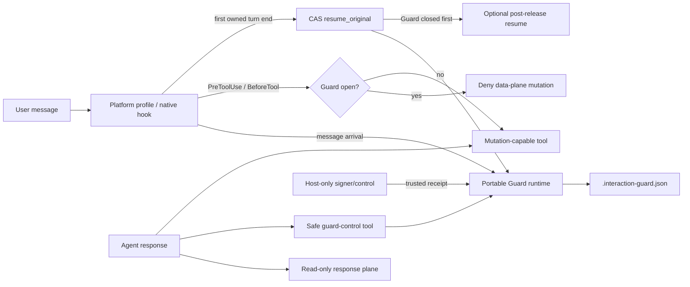
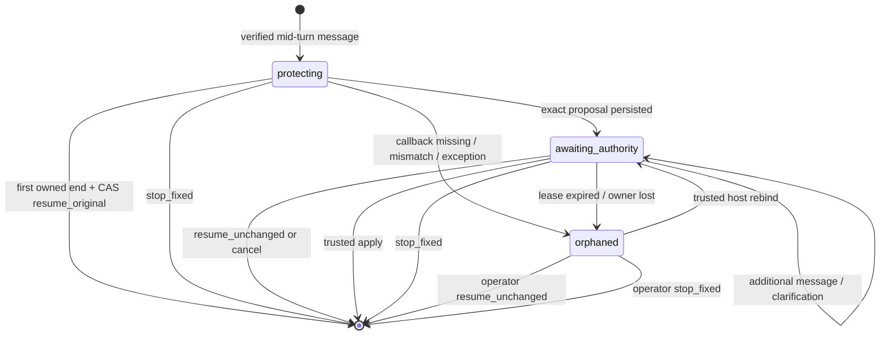

# TPlan #134：有界 Interaction Guard 与宿主生命周期 v0.2 详细设计

Date: 2026-07-22

Status: **closed / ROI-adjusted acceptance**。v0.2 direct-release runtime 已实现；真实 Codex
Desktop 运行已验证 Guard、原生 tool deny、safe stop 与无 continuation。Desktop 只作为实验性
`checkpoint_detection` carrier 验收，不代表任何平台达到完整 `mutation_prevention`；宿主级
authority boundary 与完整认证矩阵已拆至 #140。

Decision owner: Mindthus maintainer。

## 0. 一页结论

这次 Desktop E2E 暴露的不是一处条件判断错误，而是一个控制边界错误：旧实现把
“解除 Mission 写保护”依赖在“Stop 生成 continuation -> continuation 再触发
UserPromptSubmit -> 第二次 Stop 带回标记”这条链上。真实 Desktop 没有完成我们依赖的
回调相关性，Guard 因此一直保持 open；用户后续每条消息又被当成新 interruption，最终只能
手动关闭 Hook。

修订后的设计做四个决定：

1. **Guard 的安全释放不再依赖任何合成 prompt。** 第一个归属明确的 turn-end 先用 CAS、
   Mission digest 和 evidence digest 直接执行 `resume_original`；成功后 Guard 已关闭。
2. **恢复执行与解除写保护分离。** 宿主如果能可靠地继续原任务，只能在 Guard 已关闭后做
   best-effort continuation；continuation 失败不能重新锁住用户。
3. **数据面 fail-closed，控制面保持可达。** 普通 Mission/worktree mutation 继续阻断；
   `inspect`、`await_proposal`、`stop_fixed` 通过严格定型的 Agent 控制接口可用；
   `resume_unchanged` 只允许 turn-end workflow 或用户/operator 发起。
   `apply_authorized_change` 不暴露给 Agent。
4. **平台不再共享未经实测的 Stop 语义。** Codex Desktop、Codex CLI、Claude Code、
   Gemini CLI 使用独立 profile 和独立真实 E2E 认证；相同事件名不等于相同生命周期。

该方案可以彻底修掉本次“停不下来”的循环。它不能凭 Hook 猜出可信用户授权；Desktop
若要完成 `apply_authorized_change`，仍需要宿主保护的 signer/control surface。没有这条能力
时可以安全地阻止变化、恢复原路径或固定停止，但不能伪称已完成完整授权闭环。

## 1. 事故证据与根因

### 1.1 已实测事实

| 环节 | Desktop 实测 | 设计结论 |
| --- | --- | --- |
| `UserPromptSubmit` 收到中途用户消息 | 成功 | 可用于同步打开 Guard |
| Guard sidecar 持久化并绑定 session/turn | 成功 | portable core 有效 |
| `PreToolUse` 阻断后续 mutation | 成功 | 本地工具门有效，但仍受宿主覆盖边界限制 |
| 第一轮 `Stop` 生成 continuation prompt | 成功 | 宿主接受了 `decision:block` |
| continuation 重新经过预期的 `UserPromptSubmit` 并被 nonce 关联 | 未观察到 | 不能作为 Guard 释放前提 |
| 第二次可验证 turn-end 完成 `resume_original` | 失败 | Guard 永久保持 open |
| 用户通过普通对话停止 Mission | 失败 | 控制面被数据面 Guard 一并封死 |

这里不能扩大结论为“Desktop 没有 Stop hook”或“`stop_hook_active` 永远不存在”。准确结论是：
**当前版本的真实 Desktop 没有完成本实现要求的 continuation 回调相关性，因此这条协议未经证明且实际失败。**

### 1.2 直接根因

旧状态要求同时满足：

```text
continuation_requested
AND continuation_observed
AND stop_hook_active
AND matching continuation_turn_id
```

任一条件缺失都会继续保持 Guard；而保持 Guard 后，Stop 又会继续生成新的模型可见提示。
安全状态的退出条件依赖自身生成的新输入，形成递归闭环。

### 1.3 更深层的控制错配

- Hook/workflow 应负责：Guard 开关、CAS、digest、幂等、写入阻断、异常恢复。
- Agent 应负责：理解用户语义、回答状态、形成精确 proposal。
- 宿主/用户应负责：授权改变目标、确认 proposal、紧急退出。
- 真实事件 trace 应负责：限制平台能力 claim。

旧实现让 Agent 可见的 continuation prompt 同时承担恢复调度、状态相关性和 Guard 释放，
等于让一段对话文本接管了本应由宿主/workflow 持有的控制权。

## 2. 不可违反的系统不变量

### 2.1 Mission 不变量

1. 中途消息本身不获得 Mission mutation 权限。
2. Guard open 时，受支持的 Mission/evidence writer 继续在共同 commit 入口 fail-closed。
3. `resume_original` 只在 revision、全部 pending refs、Mission digest 和 evidence boundary
   同时匹配时关闭 Guard。
4. `stop_fixed` 只能产生 #134 已定义的固定差异；不得新增节点、改变目标或切换 active id。
5. `apply_authorized_change` 必须绑定可信 receipt；Agent 可见内容不能自签。

### 2.2 人类可控性不变量

1. **任何 Hook 输出都不得生成一个“必须再次被观察才能解锁”的 prompt。**
2. Guard 可以阻断数据 mutation，但不能阻断读取、状态说明和安全控制动作。
3. 缺失 end callback、hook exception、timeout、乱序或 crash 只能进入 `orphaned`，不能继续
   生成 continuation。
4. 同一个 Guard 在仍未关闭时允许生成的自动 continuation 数量必须为 `0`。
5. 用户停用 carrier 时不得静默删除 Guard；重新启用后进入恢复流程，而不是重新递归锁定。
6. 用户必须存在不依赖 Agent 判断的 `resume_unchanged` 或 `stop_fixed` 恢复入口。

### 2.3 Claim 不变量

1. 单元测试只能证明 adapter 逻辑，不证明宿主生命周期。
2. 不同产品、surface、版本分别认证；`codex-cli` 与 `codex-desktop` 不互为证据。
3. 未认证版本默认降级，不根据产品名称自动继承历史 profile。
4. 原始 filesystem process、已启动的 `write_stdin` session 和宿主 hook opt-out 必须写入
   capability scope，不能被 `mutation_prevention` 这个词隐藏。
5. 同一事件上的其他 Hook 可能并发运行；认证必须记录全部 active hook source，并排除或实测
   会生成额外 continuation、修改输入或改变 tool decision 的冲突 Hook。

## 3. 三个平面与控制权

| 平面 | 允许内容 | 控制者 | Guard open 时 |
| --- | --- | --- | --- |
| Response plane | 回答问题、只读 survey/render、说明 proposal | Agent | 保持可用 |
| Data plane | Mission、route-affecting evidence、worktree mutation | Runtime + native gate | 默认拒绝 |
| Control plane | inspect、await、resume unchanged、fixed stop、host-authorized apply | Runtime + host/user | 必须保持可达 |

控制面不是一个更宽松的 Bash allowlist。它只能提供固定 schema、固定效果的专用操作，
并按调用者拆开权限：

```text
Agent:             guard.inspect / guard.await_proposal / guard.stop_fixed
turn-end workflow: guard.resume_unchanged
operator:          guard.inspect / guard.resume_unchanged / guard.stop_fixed
```

以下操作不能成为 Agent tool：

```text
guard.disable
guard.force_unlock
guard.apply_authorized_change
receipt.sign
```

## 4. 目标架构



主要变化是 `E -> G` 发生在任何 `Q` 之前。`Q` 只负责“能否在同一宿主回合继续干活”，
不再负责“用户能否退出保护状态”。

## 5. Guard v0.2 状态机

### 5.1 状态

| Phase | 含义 | Data plane | 正常出口 |
| --- | --- | --- | --- |
| absent | 无中途消息保护 | 正常 | mid-turn message -> `protecting` |
| `protecting` | 正在回答一个或多个 interruption | blocked | first owned end -> resume；proposal -> await；stop -> fixed stop |
| `awaiting_authority` | 精确 proposal 已展示，等待新授权 | blocked | cancel/resume、fixed stop、trusted apply |
| `orphaned` | 生命周期缺失、乱序、crash 或完整性歧义 | blocked | operator resume、fixed stop、host rebind |

关闭成功后删除 sidecar；terminal disposition 写入 execution trace。`orphaned` 不是自动解锁，
它是“Mission 仍安全，但对话不再被 Hook 循环接管”的可恢复状态。

### 5.2 转移



### 5.3 Lease 语义

Guard 增加 owner lease，但 lease 到期只触发 `orphaned`，绝不自动恢复 mutation：

```json
{
  "owner_session_id": "...",
  "owner_turn_id": "...",
  "opened_event_id": "...",
  "deadline_at": "...",
  "last_event_seq": 7
}
```

这实现双重失败语义：Mission 数据面继续 fail-closed；对话和恢复控制面 fail-open。

## 6. 宿主事件协议

### 6.1 `message_arrival`

平台 profile 将真实事件标准化为：

```json
{
  "event_id": "host-unique-id",
  "session_id": "...",
  "turn_id": "...",
  "message_ref": "host-id-or-hash",
  "delivery_kind": "human | host_resume | unknown"
}
```

规则：

- 正常第一条消息只建立 active-turn marker。
- active turn 尚未收到归属明确的 end 时，新 human message 打开或扩展 Guard。
- Guard 已经存在时，即使上一回合的 active-turn marker 已清除，新的 human message 仍追加到
  原 Guard；这保证 `awaiting_authority` 的后续确认不会被误当成新的普通回合。
- 相同 `event_id/message_ref` 幂等；新消息只增加 revision，不重置 baseline。
- `delivery_kind=unknown` 不能被当成可信授权。
- 不保存 prompt 原文。

### 6.2 `before_tool`

处理顺序：

1. 先检查是否为精确命名的 guard-control tool。
2. 若是，校验 tool schema 和 Mission binding；只允许固定效果。
3. 否则 Guard open 时按平台固定 read-only allowlist 判断；未知工具拒绝。
4. 不论 native hook 是否覆盖，TPlan writer 在 runtime commit 层再次检查 Guard。

不得根据 Bash 字符串前缀放行控制命令，因为 `safe-command && mutation`、shell expansion 和
路径替换会让字符串 allowlist 变成绕过面。优先使用 Mission-scoped MCP/local function tool；
没有专用工具的 carrier 只获得较低能力。

### 6.3 `turn_end`

当归属当前 Guard 的第一个真实 end 到达：

1. 在 runtime lock 内重读 Guard。
2. 若 phase 为 `protecting`，读取当前 revision 和全部 pending refs。
3. 调用现有原子 `resolve_interaction_guard(..., disposition="resume_original")`。
4. 成功：清除 active marker，返回空成功；**不得返回 `decision:block`**。
5. stale revision、digest drift、binding mismatch 或异常：转 `orphaned`，清除 active marker，
   返回一次 user-visible warning，但允许 turn 结束。
6. 若 phase 为 `awaiting_authority/orphaned`，只清 active marker并提示当前状态；不生成 prompt。

重复 end 在 Guard 已关闭后为幂等 no-op。

### 6.4 Post-release resume

“回答后继续原任务”是独立能力：

```text
release_strategy = on_first_owned_end | host_callback | checkpoint_only
resume_strategy  = none | post_release_continue | host_callback
```

只有 Guard 已经成功关闭后，认证过的 profile 才能使用 `post_release_continue`。失败、丢失或
重复只影响执行调度，不影响 Mission 安全和用户退出。Codex Desktop 初始 profile 必须为
`resume_strategy=none`；以后若真实 E2E 证明可用，再单独升级。

### 6.5 Crash、timeout、compaction 与乱序

- Hook 内部异常：尝试原子标记 `orphaned`；无论标记是否成功，都不能返回 continuation。
- Host outer timeout：下一次 callback/checkpoint 检测 owner lease，转 `orphaned`。
- App restart / compact：`SessionStart` 读取 active marker；有未完成 owner 时不猜测完成，转
  `orphaned` 并展示恢复动作。
- 新消息与 end 并发：revision CAS 决胜；stale end 不能关闭后来消息的 Guard。
- 第二 session：不能接管；只允许 host-authenticated rebind 或 operator recovery。

## 7. 四种 disposition 的执行协议

| Disposition | 谁可以发起 | Runtime 条件 | Agent 是否可直接调用 |
| --- | --- | --- | --- |
| `resume_original` | turn-end workflow / operator | revision、pending refs、双 digest 匹配 | 否；回答过程中不能自行解锁 |
| `await_clarification` | Agent | 只写精确 proposal/question，不改 Mission | 是 |
| `stop` | Agent safe tool / operator | 仅 fixed diff，baseline active task 不变 | 是 |
| `apply_authorized_change` | trusted host | receipt + exact proposal + fresh confirmation | 否 |

### 7.1 Safe guard-control tool

新增 Mission-scoped 控制工具，建议 MCP 名称固定为：

```text
mcp__tplan_guard__inspect
mcp__tplan_guard__await_proposal
mcp__tplan_guard__stop_fixed
```

服务启动时绑定唯一 Mission canonical path，调用参数不接受任意 `mission_dir`。所有 mutation
仍进入同一 runtime lock/transaction；PreToolUse 只按精确 tool name 放行。该 server 不读取
receipt secret，也不提供 `apply`、`unlock`、`disable`。

`resume_unchanged` **不能**出现在 Agent-facing server 中。否则 Agent 可以在尚未完成中途消息
处理时提前关闭 Guard，再调用普通 mutation tool，形成解锁绕过。它只能由第一个真实
turn-end 自动执行，或由 operator 恢复通道执行。

`stop_fixed` 对 Agent 可用，是因为 #134 已将它定义为非扩张性的安全例外；即使 Agent 判断
保守，它也只能把 baseline task 置为 blocked/requires_human，不能重写 Plan。

### 7.2 Trusted apply

完整变更流程保持双阶段：

1. Agent 调用 `await_proposal`，持久化完整 decision digest 和 mutation digest。
2. 用户在 proposal 之后发出新的确认。
3. 宿主通过结构化 control surface 或确定性确认 envelope 签发 receipt。
4. host-only adapter 调用 `apply_authorized_change`；Agent tool 列表中不存在该操作。

若采用确认 envelope，必须是协议而不是自然语言分类，例如：

```text
TPLAN_CONFIRM guard=IG... revision=4 proposal=P...
```

只有同时满足以下条件才能签名：

- callback 能证明这是新的 human-origin message；
- signer secret/state 对 Agent 不可读、不可写、不可作为命令参数或环境暴露；
- proposal id、revision、baseline 和 message ref 全部匹配；
- receipt 一次性消费。

任一条件在具体 Desktop/CLI 上无法证明，则该 profile 必须报告
`trusted_authority=false`，只能继续 await、resume 或 stop。

## 8. 人类恢复与熔断

### 8.1 正常停止

用户自然语言表达“结束 Mission”时，Agent 应调用 `stop_fixed` safe tool；Guard 不再拦截这个
专用 control tool。成功后后续 Stop 看到 Guard absent，直接结束。

### 8.2 模型无响应时的确定性恢复

每个平台应提供不依赖 Agent 语义判断的控制 envelope，并做真实 E2E：

```text
TPLAN_CONTROL guard=IG... revision=R action=resume
TPLAN_CONTROL guard=IG... revision=R action=stop
```

`UserPromptSubmit`/等价 human-message callback 在模型运行前处理它：

- `resume` 只允许 digest 未漂移的 `resume_original`；
- `stop` 只允许固定 stop diff；
- 成功后阻止该 envelope 进入模型，并向用户显示结果；
- stale/mismatch 不做 mutation，只显示 recovery 状态。

这两个动作不提供 arbitrary apply，因此即使被重复也不会扩张 Mission 权限。具体宿主若会在
Hook 之前吞掉该 envelope，必须换用宿主 UI/CLI control surface；未经 E2E 不算恢复能力。

### 8.3 熔断规则

```text
unresolved_guard_continuation_budget = 0
post_release_continuation_budget     = profile-specific, max 1
consecutive_end_resolution_failures  = 1 -> orphaned
```

一旦 `orphaned`：

- 不再生成 model-visible continuation；
- 新用户消息仍可进入 response plane；
- 普通 mutation 仍被拒绝；
- 每个 turn 最多显示一条短 warning，包含 guard id、状态和恢复入口；
- 不要求用户修改或删除 `.interaction-guard.json`。

### 8.4 禁用 Hook

禁用 Hook 只停止 carrier，不删除 Guard。重新启用或运行 operator recovery 时：

- baseline 完整 -> 可 `resume_unchanged`；
- 用户要结束 -> `stop_fixed`；
- 有 drift -> 保持 `orphaned` 并报告 `runtime_integrity`；
- 不提供 `force_unlock`。

## 9. 数据结构

### 9.1 Interaction Guard v0.2

在 v0.1 字段基础上增加：

```json
{
  "schema_version": "tplan.interaction_guard.v0.2",
  "guard_id": "IG...",
  "phase": "protecting | awaiting_authority | orphaned",
  "revision": 4,
  "platform": "codex-desktop",
  "platform_profile_id": "codex-desktop@0.145.0-alpha.27",
  "binding_id": "session...",
  "baseline_digest": "sha256:...",
  "baseline_evidence_digest": "sha256:...",
  "baseline_active_task_id": "T1",
  "messages": [],
  "lease": {
    "owner_session_id": "...",
    "owner_turn_id": "...",
    "opened_event_id": "...",
    "deadline_at": "...",
    "last_event_seq": 7
  },
  "recovery": {
    "reason": null,
    "allowed_actions": ["resume_unchanged", "stop_fixed"]
  }
}
```

`phase` 迁移映射：旧 `open -> protecting`，旧 `awaiting_clarification -> awaiting_authority`。

### 9.2 Host session v0.2

删除 Desktop 必需路径中的：

```text
continuation_requested
continuation_observed
continuation_token
continuation_turn_id
```

替换为：

```json
{
  "schema_version": "tplan.host_session.v0.2",
  "profile_id": "codex-desktop@0.145.0-alpha.27",
  "session_id": "...",
  "event_seq": 7,
  "active_turn": {
    "turn_id": "...",
    "first_message_ref": "...",
    "started_event_id": "..."
  },
  "guard_binding": {
    "guard_id": "IG...",
    "owner_turn_id": "..."
  },
  "post_release_resume": {
    "strategy": "none",
    "budget": 0,
    "status": "disabled"
  },
  "last_failure": null
}
```

## 10. 平台 profile 与能力报告

共享的是 Guard contract，不是事件假设。每个平台 profile 至少声明：

```text
message_event
before_tool_event
turn_end_event
human_origin_provenance
release_strategy
resume_strategy
safe_control_transport
trusted_authority_transport
hook_state_isolation
preexisting_process_containment
outer_timeout_semantics
certified_host_versions
```

### 10.1 初始平台矩阵

| Profile | 初始 release | 初始 resume | 当前真实证据 | 发布姿态 |
| --- | --- | --- | --- | --- |
| Codex Desktop | first owned `Stop` direct CAS | `none` | arrival、PreTool deny 已证；旧 continuation 失败 | 默认禁用旧实现，重做后单独认证 |
| Codex CLI | first owned `Stop` direct CAS | 默认 `none` | 文档/合成测试不等于真实 E2E | 独立实测，不能继承 Desktop |
| Claude Code | first owned `Stop` direct CAS | 默认 `none` | 仅 contract/synthetic | 独立实测，不复用 Codex nonce 逻辑 |
| Gemini CLI | first owned `AfterAgent` direct CAS | 默认 `none` | 仅 contract/synthetic | 独立实测 |
| 无 lifecycle hook | checkpoint 或 prompt | `none` | 依 carrier 而定 | `checkpoint_detection` 或 `advisory_only` |

`SUPPORTED_PLATFORMS` 中简单复制字典的做法应移除，改为独立 profile module。未知版本即使事件
字段相同，也不能自动获得已认证版本的 capability claim。

### 10.2 能力向量与总等级

保留 issue 的三个 public level，但增加可审计向量：

```json
{
  "enforcement_level": "advisory_only | checkpoint_detection | mutation_prevention",
  "deployment_status": "blocked | experimental | certified",
  "scope": "tplan_runtime_writers",
  "capabilities": {
    "message_arrival": true,
    "runtime_writer_gate": true,
    "native_tool_gate": "partial",
    "bounded_end_resolution": true,
    "same_turn_resume": false,
    "safe_stop": true,
    "trusted_authority": false,
    "operator_escape": true,
    "preexisting_process_containment": false
  }
}
```

总等级不能掩盖缺口。`mutation_prevention` 至少要求同步 arrival、runtime writer gate、bounded
end resolution、准确 binding 和 operator escape 全部真实通过；完整 #134 close gate 还要求
safe stop 与 trusted authority 的 acceptance case 通过。

## 11. 代码改造清单

### 11.1 Portable runtime

`skills/tplan/scripts/tplan_runtime.py`

- 升级 Guard schema 到 v0.2，并兼容读取 v0.1。
- 增加 `orphan_interaction_guard()`，只改变 sidecar phase/recovery metadata。
- 增加 `resolve_guard_at_turn_end()`：在一次 lock/transaction 内读取最新 revision、ack 当前
  pending refs、校验双 digest、执行 `resume_original`。
- 保留并复用现有 `stop_interaction_guard()` fixed diff。
- `apply_authorized_change` 继续只接受 host receipt；不增加 agent-facing shortcut。
- 所有 resolve/orphan/stop 写 execution trace，支持 crash roll-forward。

### 11.2 Guard control transport

新增 Mission-scoped safe control server，例如：

`skills/tplan/scripts/tplan_guard_control_server.py`

- Agent-facing server 只暴露 inspect/await/stop 三个固定 tool；operator CLI 另行提供 resume。
- 启动时绑定 canonical Mission，不接受调用方切换路径。
- 不持有 receipt secret。
- 每次调用携带 guard id/revision，走 runtime CAS。
- 配套 operator CLI 只提供相同的非扩张动作；无 `force-unlock`。

### 11.3 Host adapter

拆分 `skills/tplan/scripts/platform_interaction_hook.py`：

```text
interaction_host/core.py
interaction_host/profiles/codex_desktop.py
interaction_host/profiles/codex_cli.py
interaction_host/profiles/claude_code.py
interaction_host/profiles/gemini_cli.py
```

- core 只处理标准事件和状态机。
- profile 负责 native input/output shape。
- Desktop profile 删除 Guard-open 时的 Stop continuation。
- safe control tool 使用精确名字 allowlist。
- 任何异常路径都结束当前 hook，不再生成递归 prompt。

### 11.4 Generator 与 supervisor

`generate_interaction_hooks.py`

- 只为已认证 profile 默认生成配置。
- 未认证 profile 需要显式 `--experimental`，输出 capability ceiling 和恢复说明。
- 生成独立的 platform/profile id，不再把 Desktop 当 CLI alias。
- 同时生成卸载/恢复说明，但不自动覆盖用户现有 Hook。

`hook_supervisor.py`

- 保留内层 timeout 和 exit normalization。
- 记录 sanitized event/result code，不记录 prompt。
- supervisor failure 不得转换为 Stop continuation。

### 11.5 文档

- 重写 `resources/interaction-host-contract.md` 的通用 two-stage turn-end 段落。
- `resources/platforms/codex.md` 分开 Desktop 与 CLI 的独立 profile/认证状态。
- Claude/Gemini 文档只描述各自已经实测的语义。
- 增加 certification artifact schema 与失败记录。

## 12. 迁移与兼容

1. 当前 Desktop hook 配置保持关闭，不自动恢复。
2. v0.1 host state 若存在 `continuation_requested=true`，升级后不得继续 nonce 协议；Guard 转
   `orphaned(reason="legacy_continuation_state")`。
3. 若 v0.1 Guard baseline 完整，operator 可显式 resume；runtime 不在迁移时静默关闭。
4. 老 Mission 无 sidecar 仍视为 guard absent；只读不创建 sidecar。
5. 旧 transaction journal 继续按现有兼容路径恢复。
6. 新 generator 不删除旧配置，只检测并报告冲突；用户确认后再替换。

## 13. 测试与真实认证

### 13.1 单元/契约测试

| Case | 必须断言 |
| --- | --- |
| first owned end | 一次 Stop 直接关闭 protecting Guard；输出不含 continuation |
| end mismatch | Guard -> orphaned；turn 结束；没有第二 prompt |
| overlapping message | stale end CAS 失败；新 pending ref 不丢失 |
| status inquiry | Mission/evidence digest 不变，active T1 不变 |
| mixed message | 状态可回答；proposal 保持 locked；无自动 mutation |
| fixed stop | 只出现 fixed diff；Guard 原子关闭 |
| arbitrary tool | native deny + runtime writer deny |
| safe control tool | 精确 MCP 名称通过；未知/伪装名称拒绝 |
| premature agent resume | Agent-facing tool surface 中不存在 resume；普通命令无法绕过 PreTool |
| crash boundaries | roll-forward 后 closed 或 orphaned，无 ghost evidence |
| duplicate events | 幂等，无 revision inflation |
| legacy v0.1 | 不再进入 nonce loop，迁移到 recoverable state |

删除“测试手工调用第二次 synthetic UserPromptSubmit 就证明平台支持”的 claim。该测试最多保留为
profile parser 单测，不能进入宿主认证结果。

### 13.2 Desktop 真实 E2E

必须从全新 Desktop 进程、真实 hook config 和真实 UI 消息执行，adapter 测试代码不得直接伪造
lifecycle callback。记录 sanitized append-only trace：

```text
host build / app version
profile digest
active hook sources and hashes
hook trust/enablement state for every non-managed source
event seq + event name
session_id hash / turn_id hash / message_ref hash
guard phase + revision before/after
hook result kind
Mission/evidence digest before/after
```

至少覆盖：

1. active T1 中发送“进度？”；Guard 在后续 mutation 前存在。
2. `add_node`/`apply_patch`/route evidence write 被拒，磁盘无部分写。
3. 回复结束时第一个 Stop 直接关闭 Guard；`stop_block_decisions == 0`。
4. 不出现 `TPLAN_CONTINUATION`，下一条普通用户消息可正常进入。
5. active turn 中发送“结束 Mission”；safe control tool 完成 fixed stop。
6. 模型不调用 control tool 时，operator envelope 能 resume/stop，不需编辑 Hook 文件。
7. 两条重叠消息不重置 baseline；stale end 不误关。
8. Stop handler exception、inner timeout、app restart、compact 后进入 orphaned，不递归。
9. hook disable/re-enable 后可恢复，不静默解锁。
10. 若申报 trusted authority：proposal -> 新确认 -> host receipt -> exact apply；伪造/重放失败。

同一精确 host build 至少连续三次从冷启动通过；任一次出现递归 continuation、需手改文件才能
退出、Guard 未在 mutation 前持久化或 scope claim 超出证据，都判定该 profile 认证失败。
若宿主把新 command hook 标记为待 review 或未信任，也必须先完成对该精确 hash 的显式信任；
“配置文件存在但 hook 未运行”是部署未完成，不得记成 runtime 通过或失败。
认证期间若存在未纳入 trace 的并发 Stop/UserPromptSubmit/PreToolUse Hook，也不能签发证书。

### 13.3 其他平台

Codex CLI、Claude Code、Gemini CLI 分别运行同一行为场景，但使用各自原生事件和输出；不能用
一个平台的 trace 代替另一个平台。每份认证记录 exact version、OS、shell、hook source、
profile digest 和 unsupported capability。

## 14. 实施顺序

这不是“先做一半就宣称完成”的 A/B 拆分，而是同一个设计的风险顺序：

1. **先消除锁死路径**：隔离当前 Desktop profile，移除 Guard-open continuation，加入
   `orphaned` 与 direct release。
2. **再打通安全控制面**：safe MCP/control tool、operator resume/stop、PreTool 精确放行。
3. **完成 Desktop 冷启动 E2E**：先认证 resume/stop/mutation gate；能力不足如实留空。
4. **接入 trusted host authority**：只有 signer isolation 与 human-origin confirmation 可证后，
   才测 authorized apply。
5. **逐平台复制 contract，不复制结论**：CLI、Claude、Gemini 独立 profile 和证书。

每一步都必须保持当前 Desktop Hook 默认关闭，直到至少步骤 1-3 完成并通过逃生测试。

## 15. #134 ROI 调整后的关闭门槛

本 issue 已按下列口径关闭：

- portable Guard/transaction/write choke point 的 acceptance 全通过；
- 真实 Desktop E2E 证明 mid-turn Guard、后续 native tool deny、bounded direct release、safe
  stop，以及 stop 后无 continuation；
- Desktop certification artifact 固定为 `partial` / `checkpoint_detection`，并如实记录 same-UID、
  无 stable message identity、无 host-only receipt signer 等限制；
- 三份独立审计确认没有新的 P0 或 agent-invocable unlock/signer 绕过；
- 临时 E2E Hook 与 MCP 配置已移除，不能被当作长期正式部署；
- host-native authority boundary、trusted receipt 与完整 `mutation_prevention` 认证矩阵已拆至 #140。

这不是把 `checkpoint_detection` 改名为 prevention。完整宿主级认证仍需单独的产品能力和真实
E2E；#134 的交付范围是消除递归锁死、让 supported TPlan writer fail-closed，并对 Desktop 能力
诚实降级。

## 16. 明确边界

- 本设计不保证模型注意力从不短暂切换；它保证控制状态不随对话输入自动漂移。
- Native tool hook 不是任意进程沙箱；支持的 runtime writer 做 prevention，raw edit 做 digest
  detection，已启动进程单独报告。
- Hook 可以提供 safe resume/stop，但不能凭 Agent 文本生成可信 receipt。
- 如果 Codex Desktop 无法提供 signer isolation/human-origin control，官方 Desktop Hook profile
  仍可实现安全的默认恢复与 fixed stop，但 `trusted_authority=false`；完整授权能力必须由更强的
  host adapter 提供。
- Prompt fallback 继续只是 `advisory_only`，不能因文案更强而升级 claim。
